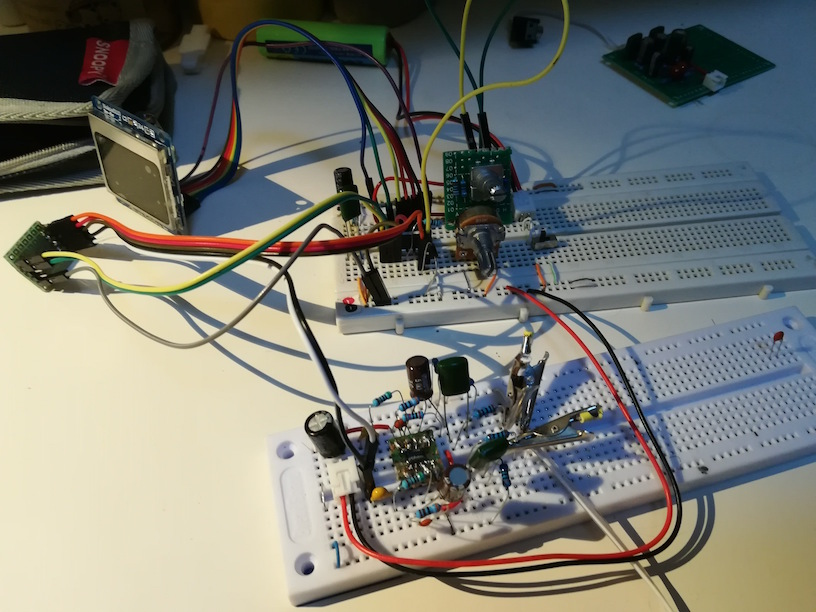
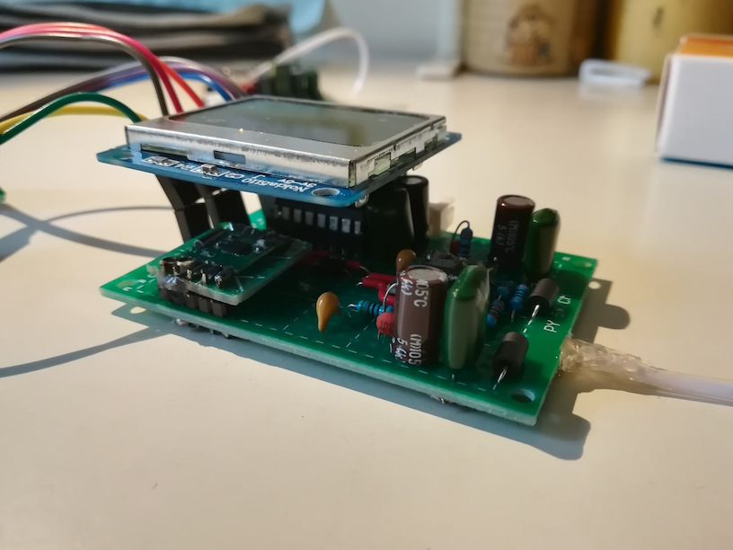
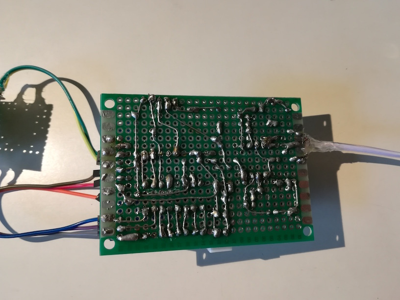

In summer 2018, the poor performance of my old radio receiver became a real headache: I was attending the CET 6 English Test in the coming months, in which a good receiver is a must. This gives me adequate motivation to build my own one.

# Receiver Chip

I surveyed thoroughly on the Internet, and selected a receiver DSP chip, `Si4702`, manufactured by *Silicon Labs*. It has sufficient SNR and sensitivity for daily operation. We need a microcontroller to set up the parameters and running mode for the receiver chip. They communicate through a specialised I2C protocol, which costs some time in implementation and testing.

# Display

A Nokia is not always an outmoded design. I chose a matrix LCD, `PCD8544` , that was massively used on old Nokia models. Communication protocol, as well as font specification, are major difficulties in this part.

# Amplifier

Since I didn't plan to equip the radio receiver with a speaker, any low-power headphone amplifier would do. *NXP*'s `TDA1308` is a good choice after experiment. There's an unexpected benefit: The headphone serves as an antenna, so we don't have to explicitly mount one.

# Gallery

{:width="50%"}

{:width="50%"}

{:width="50%"}

