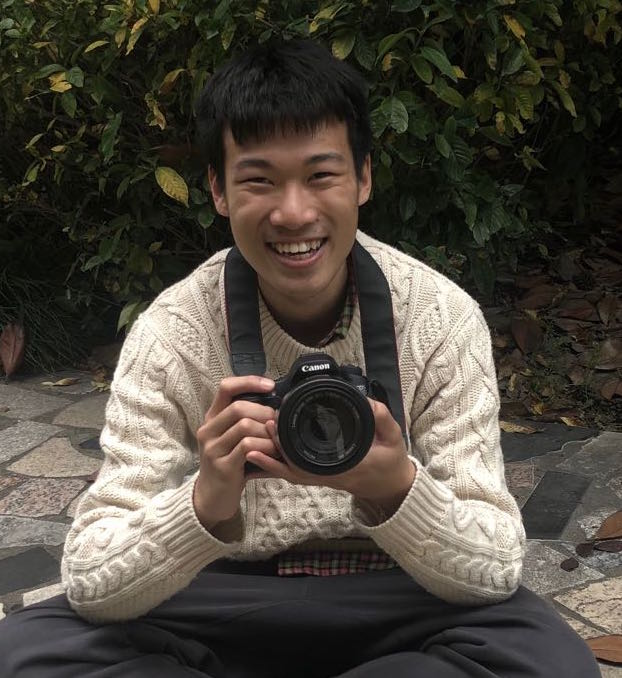

<table border="0">
  <tr>
    <td width="75%">
      

        I'm a senior undergraduate in Computer Science Department at Shanghai Jiao Tong University, China. With interests in randomised algorithms and complexity theory, I am currently working on sampling and counting problems.
      

      <!-- 
 My <a href="/second.html">Curriculum Vitae</a> 
 -->
    </td>
    <td width="25%">
      
    </td>
  </tr>
</table>

## Research Projects

### CFTP Perfect Sampler for monotone CNF Formulas

- An efficient perfect sampler based on CFTP method
- Meets hardness bound up to polynomial factor

### *SimPL* interpreter

- Enables imperative and functional programming
- Built-in type inference mechanism and Hindley-Milner polymorphism
- Supports garbage collection, stream operation, and tail recursion optimisation
- [GitHub](https://github.com/YanhengWang/SimPL) | [Specification](./SimPL.pdf)

### Uniform Sampler on 2D Space

- Gives efficient algorithms in sampling regular/irregular 2D space
- Uses monotonicity of cumulative distribution function to perfrom binary search
- Could run arbitrarily faster than simple rejection sampling

### Artificial Intelligence for the Game of Draughts

- Applies Monte Carlo tree search to the game of Draughts
- Uses deep learning to evaluate the outcome of a position
- [GitHub](https://github.com/YanhengWang/Draughts)

* * *

## Slides & Notes

### Randomisation
- [Markov Chain Toolbox](./documents/MCtoolbox.pdf)
- [Lower Bounds on Mixing Times](./documents/MClowerbound.pdf)
- [Introduction to CFTP](./documents/CFTP.pdf) (Talk given in a seminar on sampling)
- [CFTP Sampler for Proper Colourings](./documents/CFTP-colouring.pdf)
- [Lovasz Local Lemma: from Probabilistic to Constructive](./documents/LLL.pdf)

### Theory of Computation

### Linear Programming

* * *

## Grocery
- [DSP Radio Receiver](./radio.html)
- [Remote Control Boat](./boat.html)
- [Nixie Tube Timer](./nixie.html)

