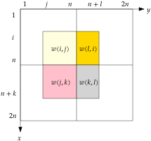
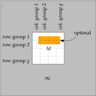

We first study an intermediate problem:

> **Min Centred Submatrix**
> Given a $$2n \times 2n$$ matrix, compute indices $$1 \leq i,j \leq n < k,l \leq 2n$$ such that the submatrix with corners $$(i,j)$$ and $$(k,l)$$ has minimum sum.

# Min 4-Cycle ↔ Min Centred Submatrix

For the → reduction, we are given a complete 4-partite graph $$G$$ on $$I \cup J \cup K \cup L$$. Assume that the vertices in each part are labelled $$1, \dots, n$$. We construct a matrix $$M \in \Int^{2n \times 2n}$$ that satisfies the following equations for all $$1 \leq i,j \leq n < k,l \leq 2n$$:

$$\begin{align*}
    w(i, j) &= \sum_{x = i}^n \sum_{y = j}^n M_{x y}\\
    w(j, k) &= \sum_{x = n + 1}^{n + k} \sum_{y = j}^n M_{x y}\\
    w(k, l) &= \sum_{x = n + 1}^{n + k} \sum_{y = n + 1}^{n + l} M_{x y}\\
    w(l, i) &= \sum_{x = i}^n \sum_{y = n + 1}^l M_{x y}.
\end{align*}$$

Essentially, the matrix consists of four quadrants around the centre $$(n,n)$$. The top-left (resp. bottom-left, bottom right, top-right) quadrant encodes the edge weights between $$IJ$$ (resp. $$JK$$, $$KL$$, $$LI$$). See the picture below for illustration. Note that $$M$$ exists and can be computed in $$O(n^2)$$ time by filling the entries from the centre outwards.

{:.centering}

Every 4-cycle $$ijkl$$ in $$G$$ one-one corresponds to a centred submatrix $$[i, n + k] \times [j, n + l]$$ in $$M$$. Moreover, the weight of the cycle is exactly the sum of the submatrix. This concludes the → reduction.

The ← reduction is simply the inverse of the → reduction.

# Min Centred Submatrix → Min Submatrix

Given $$M \in \Int^{2n \times 2n}$$, we extend it to a matrix $$M' \in \Int^{(2n+1) \times (2n+1)}$$ by inserting a row (resp. column) immediately after the $$n$$-th row (resp. column). Hence, the new row and column together form a "cross". Let $$N > \max_{i,j} \card{M_{ij}}$$ be large number. We put $$-N$$ on the five most centric entries on the cross, and 0 on the rest of the cross. This forces the min submatrix in $$M'$$ to span all four quadrants, as taking a $$-N$$ is strictly more beneficial than staying inside one or two quadrants. Hence, the solution corresponds to a min centred submatrix of $$M$$, and their weights differ by exactly $$5N$$.

# Min Submatrix → Min Centred Submatrix

## Lemma: algorithm on retangular matrices

We show how to solve Min Submatrix of an $$m \times n$$ matrix $$M$$ in time $$O(m^2 n)$$. (Think of $$m \ll n$$ so that the running time is subcubic in $$n$$.) First we spend $$O(mm)$$ time to compute the "prefix sums"

$$ S_{ij} := \sum_{x = 1}^i \sum_{y = 1}^j M_{x y} $$

for $$i \in [m]$$ and $$j \in [n]$$, via the recursion $$S_{ij} = M_{ij} + S_{i, j-1} + S_{i-1, j} - S_{i-1, j-1}$$.

Next we fix $$1 \leq i_1 < i_2 \leq m$$ and compute the minimum sum given by submatrices $$[i_1, i_2] \times [j_1, j_2]$$. To this end, we use dynamic programming. Let $$f_j$$ denote the minimum sum among submatrices $$[i_1, i_2] \times [1, j], \dots, [i_1, i_2] \times [j, j]$$. We have $$f_0 := - \infty$$ and the recursion $$f_j = \min \{ 0, f_{j-1} \} + \sum_{i = i_1}^{i_2} M_{ij}$$. But note that

$$ \sum_{i = i_1}^{i_2} M_{ij} = S_{i_2, j} - S_{i_2, j-1} - S_{i_1 - 1, j} + S_{i_1 - 1, j-1}, $$

so we can readily compute all $$f_j$$'s in $$O(n)$$ time. Their minimum is what we are looking for.

We run over all $$\binom{m}{2}$$ pairs of $$(i_1, i_2)$$, repeat the same procedure, and output the global minimum. The total running time is $$O(m^2 n)$$.

## The main reduction

Suppose that algorithm $$A$$ can solve Min Centred Submatrix in $$O(n^{3 - \epsilon})$$ time. We describe an algorithm that solves Min Submatrix in truly-subcubic time. The idea is to divide the rows (resp. columns) evenly into $$g := n^{\epsilon/3}$$ groups of size $$m := n^{1 - \epsilon/3}$$ each. If the optimal submatrix lies in a single row group or a single column group, then we invoke the lemma to solve it fast. On the other hand, if the optimal submatrix spans multiple row and column groups, then we argue that it contains the centre of a matrix chosen from a small pool. The problem then reduces to solving Min-Centred-Submatrix on each matrix from the pool.

{:.centering}

For a streamlined treatment, let us pad the input matrix $$M$$ by $$\infty$$ on all sides. We index the rows and columns in the resulting matrix by $$[-n, 2n]$$. The algorithm is given below.

- $$s := \infty$$.
- For $$t = 1, \dots, g$$:
    - Use the lemma to find the minimum submatrix sum $$s'$$ in the matrix $$[1 + (t - 1) m, tm] \times [1, n]$$.
    - Use the lemma again to find the minimum submatrix sum $$s"$$ in the matrix $$[1, n] \times [1 + (t - 1) m, tm]$$.
    - Let $$s := \max \{ s, s', s'' \}$$.
- For all $$1 \leq t,t' < g$$:
    - Let $$i := tm$$ and $$j := t' m$$ be the virtual centre.
    - Call $$A$$ on $$[i-n, i+n] \times [j-n, j+n]$$; get value $$s'$$.
    - Let $$s := \max \{ s, s' \}$$
- Output $$s$$.

To see correctness, we fix an optimal submatrix $$M^*$$. If $$M^*$$ is contained in some stripe $$[1 + (t - 1) m, tm] \times [1, n]$$ or $$[1, n] \times [1 + (t - 1) m, tm]$$, then we can find it in the first loop. Otherwise, $$M^*$$ must cross the boundary between some row groups $$t$$ and $$t + 1$$, as well as the boundary between some column groups $$t'$$ and $$t' + 1$$. In particular, $$M^*$$ contains the entry $$(i, j) := (tm, t' m)$$, the intersection of these two boundaries. Also, $$M^*$$ is fully contained in $$[i - n, i + n] \times [j - n, j + n]$$, which is centred at $$(i, j)$$. Therefore, $$M^*$$ is correctly discovered in the second loop.

It remains to bound the running time. The first loop invokes the lemma $$2g$$ times, each on a rectangular matrix of shape $$m \times n$$. So we spend $$O(g \cdot m^2 n) = O(n^{3 - \epsilon / 3})$$ time in total. The second loop makes $$(g - 1)^2$$ calls to $$A$$, whose cost amounts to $$O(g^2 \cdot n^{3 - \epsilon}) = O(n^{3 - \epsilon / 3})$$ in total.
