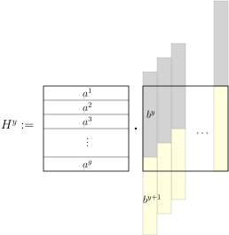

By reversing and padding the input vectors, one can reduce (Min,+) Convolution to the following problem. The details are left as an exercise.

> **(Min,+) Correlation**
>
> Given two vectors $$a,b \in \Nat^n$$, compute the vector $$(c_1, \dots, c_n)$$ where $$c_t := \min_{1 \leq i \leq n-t} (a_i  + b_{i+t})$$.

Next we reduce (Min,+) Correlation to (Min,+) Matrix Product. Let us break the input vector $$a$$ evenly into $$g := \sqrt{n}$$ blocks $$a^1, \dots, a^g$$. Similarly, we break $$b$$ into $$b^1, \dots, b^g$$. We write $$b^{g+1} = (\infty, \dots, \infty)$$. For each $$y \in [g]$$, we compute a (min,+) product $$H^y$$ of two matrices:

{:.centering}

In the matrix on the right, each column is a shifted and restricted copy of $$b^y b^{y+1}$$, which models an alignment between $$a$$ and $$b$$. By definition,

$$ H^y_{x,s} = \min \set{
	\min_{1 \leq j \leq g-s} (a^x_j + b^y_{j+s}),~
	\min_{g-s < j \leq g} (a^x_j + b^{y+1}_{j+s-g})
} = \min_{1 \leq j \leq g} (a_{(x-1)g+j} + b_{(y-1)g+s+j}). $$

After computing the matrices $$H^y$$, we proceed to recover $$c_t$$. Let us uniquely express $$t =: rg + s$$ where $$r,s \in [g]$$. Then we find

$$\begin{align*}
	c_t
	&= \min_{1 \leq i \leq n-t} (a_i + b_{i+t}) \\
	&= \min_{x \in [g]} \min_{1 \leq j \leq g} (a_{(x-1)g+j} + b_{(x-1)g+j+t}) \\
	&= \min_{x \in [g]} \min_{1 \leq j \leq g} (a_{(x-1)g+j} + b_{(x+r-1)g+s+j}) \\
	&= \min_{x \in [g]} H^{x+r}_{x,s}.
\end{align*}$$

Now let us analyse the time complexity. Suppose that an algorithm can compute the (min,+) matrix product of two $$g \times g$$ matrices in $$O(g^{3-\epsilon})$$ time. Our reduction calls it $$g$$ times, and then spends $$O(g)$$ additional time to compute each entry $$c_t$$. So we have solved (Min,+) Correlation in time $$O(g \cdot g^{3-\epsilon} + gn) = O(n^{2-\epsilon/2})$$.
