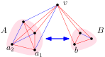

Call a graph $$G$$ *reducible* if it has a component whose complement is disconnected. In this case, $$G$$ *reduces* to graph $$G_1$$ after complementation of such component. Let us reduce iteratively whenever possible; this yields a sequence $$G \to G_1 \to \cdots \to G_t \to G'$$. Clearly the end result $$G'$$ does not depend on the choices made at the intermediate steps. We call $$G$$ a *cograph* if $$G'$$ consists of isolated vertices.

To put it simple: Cographs are those reducible to isolated vertices via repeated component complementations.

**Examples.**
$$K_n$$ (the complete graph), $$K_{n,m}$$ (the complete bipartite graph) and $$C_4$$ (the cycle of length four) are cographs.

**Counterexample.**
$$P_4$$ (the path of length three) is not a cograph as it is irreducible: The complement of its only component is $$\overline{P_4} \cong P_4$$, which is connected.

So $$P_4$$ is the smallest counterexample, but actually it captures all counterexamples! We call a graph *$$P_4$$-free* if it does not contain $$P_4$$ as an induced subgraph.

**Theorem.** $$G$$ is a cograph ⇔ $$G$$ is $$P_4$$-free.

*Proof.*
(⇒) Any induced subgraph of $$G$$ must be a cograph as well (using the same reduction sequence but restricted to the vertices of interest). Hence $$P_4$$ cannot appear as an induced subgraph.

(⇐) We show two claims:

1. A graph $$H$$ is $$P_4$$-free iff $$\compl{H}$$ is $$P_4$$-free.
2. If a connected graph $$H$$ on at least two vertices is $$P_4$$-free, then $$\compl{H}$$ is disconnected.

Assuming both, every non-singleton component in $$G$$ is reducible (by claim 2), and the graph stays $$P_4$$-free after the reduction (by claim 1). So eventually we can grind all components down to singletons, meaning that $$G$$ is a cograph.

The proof of claim 1 is easy: $$H$$ contains an induced $$P_4$$ if and only if $$\compl{H}$$ contains an induced $$\compl{P_4} \cong P_4$$.

To prove claim 2, we restate it in an apparently equivalent form:

<ol start="2">
  <li>Fix any red/blue edge colouring of \(K_n \, (n \geq 2)\) such that the red and blue (spanning) subgraphs are both connected. Then the red subgraph contains an induced \(P_4\).</li>
</ol>

We apply induction on $$n$$. For $$n = 2$$ the claim is vacuous. For $$n \geq 3$$, let us remove an arbitrary vertex $$v$$, so we are left with $$K_{n-1}$$. If its red subgraph contains an induced $$P_4$$ then we are done. Otherwise by induction hypothesis, one of its two subgraphs, say red, is disconnected. (If the blue is disconnected then we simply switch colours below.)

Now let $$A, B$$ be two components in the red subgraph of $$K_{n-1}$$. Hence all the edges in between $$A$$ and $$B$$ are blue. Adding vertex $$v$$ back to the picture, it must have

- a blue edge to $$A$$ (say) because the blue subgraph of $$K_n$$ is connected;
- a red edge to both $$A$$ and $$B$$ because the red subgraph of $$K_n$$ is connected.

{:.centering}

Let us partition $$A$$ into

$$\begin{align*}
  A_1 &:= \{ a \in A : {\b va \text{ is blue}}\} \neq \emptyset, \\
  A_2 &:= \{ a \in A : {\r va \text{ is red}}\} \neq \emptyset.
\end{align*}$$

Take $$a_1 \in A_1$$ and $$a_2 \in A$$ such that $$\r a_1 a_2$$ is red. This is always possible because $$A_1,A_2 \subseteq A$$ are connected via red edges. Take $$b \in B$$ with $$\r vb$$ red. Then the path $$a_1 a_2 v b$$ is red; its complement $$v a_1 b a_2$$ is blue. So the red subgraph (as well as the blue subgraph) contains an induced $$P_4$$. ∎

We can also characterise cographs in a more algebraic fashion. Instead of "iterative top-down reductions", we may define cographs as those generated "bottom-up" via the following rules:

- an isolated vertex is a cograph;
- the disjoint union of two cographs is a cograph;
- the complement of a cograph is a cograph.

It is obvious that the two definitions are equivalent. We leave it as an exercise to prove that cographs can be generated by an alternative set of rules:

- an isolated vertex is a cograph;
- the disjoint union of two cographs is a cograph;
- the join of two cographs is a cograph.

Here joining two graphs $$G,H$$ means connecting every pair of vertices $$(u,v) \in G \times H$$.

From these characterisations we immdiately have

**Corollary.** $$G$$ is a cograph ⇔ $$\text{modular-width}(G) \leq 2$$ ⇔ $$\text{clique-width}(G) \leq 2$$

*Proof.*
We show a loop of implications. If $$G$$ is a cograph then it can be generated from isolated vertices by unions and joins. This provides a modular decomposition of width two, thus the modular width is at most two and the clique width can only be smaller. Finally, if $$G$$ has clique width at most two then it must be a cograph: otherwise it would contain an induced $$P_4$$, which by itself has clique width three already. ∎
