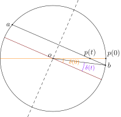
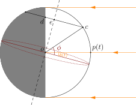
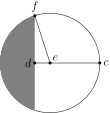

Living in central Europe for three years and knowing the winter too well, it becomes my new hobby to check the dawn and dusk time in my weather app, and to rejoy on every minute I've gained since the start of the year. Lately I had the idea to demystify the business and derive a formula for the daytime length. As I was poorly educated in—and still have a hard time learning—astronomical and geographical terms, let me keep these at a minimum. The only terms that I will be using without explanation are: north and south poles, equator, and latitude. My goal is to estimate the daytime length $$\ell$$ at a city of latitude $$\phi \in [-90^\circ, 90^\circ]$$ on a given day $$t$$.

The following simplifications well approximates the reality. The earth is assumed to be a perfect unit ball in orbit around the sun in a perfect circle. Meanwhile, the earth spins around its own axis, that is the line through the north and south poles. The axis translates in space without changing orientation during the orbit. In particular, the angle between the equator plane and the orbit plane remains constantly at 23.43°.

<iframe src="daytime-1.html" width="400" height="300" frameborder="0" class="centering"></iframe>

But our analysis would be much easier if we pin the earth in space and consider the sun as the moving object instead. From this viewpoint, the sun is in orbit around the earth in a perfect circle; the angle between the orbit plane and the equator plane is 23.43°. It is worth guarding against a potential misunderstanding. This view is *not* Geocentrism and does *not* account for the physics. It merely accounts for relative motions.

<iframe src="daytime-2.html" width="500" height="350" frameborder="0" class="centering"></iframe>

In the 3D model, I have drawn two circles on earth. The brown circle is the equator, and the orange circle lies on sun's orbit plane. Denote by $$o$$ the centre of earth. Let $$p = p(t)$$ be the point on earth's surface where sunlight casts perpendicularly. Clearly $$p$$ moves along the orange circle at an even speed over time. Let $$\delta = \delta(t)$$ be the angle between $$op$$ and the equator plane. Later we will see that $$\phi,\delta$$ together determine the daytime length.

For now we study the evolution of $$\delta$$ over time. We agree that $$t = 0$$ on June 21, or the summer solstice. Equivalently, on day 0 the angle $$\delta$$ attains its maximum value 23.43°. In the 3D model, day 0 is depicted in the position nearest to us. The projected view of earth looks like:

Both the brown and orange circles project to a line segment. We fix this view and fast forward the year. As the sun revolves, we shall see $$p(t)$$ moving to the left along the orange segment and, after hitting the leftmost point, travelling back to the right. Generally $$\lvert o p(t) \rvert = \cos(2\pi t / 365)$$. (Look at the 3D model to see why.) Now we draw a line $$ab$$ through $$p(t)$$ parallel to the brown line (equator). Note that it is the projected trajectory of $$p(t)$$ on the particular day due to earth's spin. Hence by definition $$\delta(t)$$ is exactly the angle between $$ob$$ and the brown line, as marked in the picture. To compute its value, consider the triangle $$obp(t)$$. By the law of sines, we have

$$ \frac{\sin \angle o p(t) b}{\lvert ob \rvert} = \frac{\sin \angle o b p(t)}{\lvert o p(t) \rvert}. $$

That is,

$$ \sin(23.43^\circ) = \frac{\sin(\delta(t))}{\cos(2\pi t /365)}. $$

So

$$\begin{equation}
	\delta(t) = \arcsin(\sin(23.43^\circ) \cdot \cos(2\pi t /365)) \tag{1}.
\end{equation}$$

It remains to express the daytime $$\ell$$ in terms of $$\phi$$ and $$\delta$$. To this end, we project the earth in a different direction so that $$p(t)$$ is the rightmost point and the sunlight shines from its right.

Two clarifications are in order. First, the equator is projected as an oval instead of a segment in general. (You are invited to verify it in the 3D model!) Second, the axis *seems* to tilt at an angle smaller than 23.43°, but that is superficial. We should remember that in this view, the axis is also tilting towards the depth of your screen, and the combined angle is still 23.43°.

It is easy to see that $$\lvert oe \rvert = \sin(\phi)$$ and $$\lvert ce \rvert = \cos(\phi)$$. We then calculate $$\lvert de \rvert = \sin(\phi) \tan(\delta)$$. Finally, we switch the view again and observe from above the north pole:

We have the relation $$\cos \angle def = \frac{\lvert de \rvert}{\lvert ef \rvert} = \frac{\lvert de \rvert}{\lvert ce \rvert} = \tan(\phi) \tan(\delta(t))$$. So the daytime length in hours is given by

$$\begin{equation}
	\ell(t) = 24 \cdot \left( 1 - \frac{\arccos(\tan(\phi) \tan(\delta(t)))}{\pi} \right).  \tag{2}
\end{equation}$$

The formula is complete by piecing together (1)(2).

Let us do some quick sanity checks. If the city is on the equator (latitude $$\phi = 0$$), then $$\ell(t) = 24 \cdot (1-\arccos(0)/\pi) = 12$$ regardless of the day in a year, which agrees with common sense. If the city is on the arctic circle (latitude $$\phi = 66.57^\circ$$), then on the summer solstice we have $$\delta = 23.43^\circ$$ and thus $$\tan(\phi) \tan(\delta) = 1$$. This implies $$\ell = 24$$, hence a polar day.

I wrote this note on 11 January ($$t = 204$$) at Saarbrücken ($$\phi = 49.33^\circ$$). The formula tells me that I had 8.31 hours of daylight, or 8 hours and 19 minutes. My app gives an answer of 8 hours 32 minutes. The relative error is within 3%.
