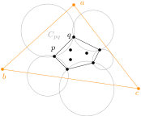
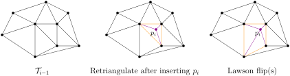
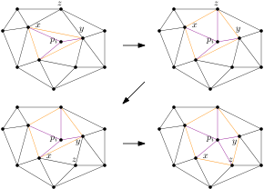
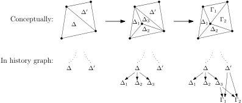
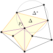

As we have seen, the Delaunay triangulation of a point set $$S \subseteq \Real^2: \lvert S \rvert = n$$ can be constructed by repeatedly applying Lawson flips on an initial triangulation (e.g. scan triangulation). The algorithm invokes at most $$\binom{n}{2}$$ Lawson flips and, if implemented appropriately, runs in $$O(n^2)$$ time.

This appendix describes a randomised algorithm that constructs the Delaunay triangulation in $$O(n \log n)$$ expected time. The idea is as simple as it could be: insert the points in a random order and build the Delaunay triangulation incrementally.

To avoid corner cases, we assume general position and introduce three dummy points $$a,b,c \in \Real^2$$ that emcompass $$S$$. They should be "far away from $$S$$" in the following sense: For every boundary edge $$pq$$ of $$\operatorname{conv}(S)$$ we find an empty circle $$C_{pq}$$ that goes through $$p$$ and $$q$$ only (which clearly exists); place $$a,b,c$$ so that they do not lie in any of these circles. Our choice of $$a,b,c$$ ensures that the Delaunay triangulation of $$S$$ is preserved in the Delaunay triangulation of $$S \cup \set{a,b,c}$$ (recall Lemma 26), so we may recover the former by removing dummy points from the latter.

{:.centering}

# Outline of the Algorithm 

> - Choose the dummy points $$a,b,c$$ and let $$\dt := \set{abc}$$.
> - Generate a random uniform permutation $$(p_1, \dots, p_n)$$ of $$S$$.
> - For $$i = 1 \dots n$$ do
>     - Locate the triangle $$\Delta \in \dt$$ that emcompasses $$p_i$$.
>     - Insert $$p_i$$ and break $$\Delta$$ into three subtriangles.
>     - Perform Lawson flips on $$\dt$$ until we observe Delaunay property.
> - Return $$\dt$$ with $$a,b,c$$ removed.

Though apparently correct, the algorithm requires careful implementation and time analysis, which spans the rest of the appendix. We will first describe a systematic approach to organise the Lawson flips, and then go back to tackle the harder "locating triangle" step.

For clarity of our exposition, we denote by $$\dt_i$$ the (Delaunay) triangulation when round $$i$$ is finished; it is determined by our random choices of $$p_1, \dots, p_i$$. In fact it is the *set* $$S_i := \set{p_1, \dots, p_i}$$ that matters, as opposed to the specific *ordering*. For example, if we know $$S_3 = \set{(0,0),(1,0),(5,2)}$$ then $$\dt_3$$ is already *uniquely determined*, no matter which one of the 3! permutations took place. Keep this fact in mind as we need it everywhere in the time analysis.

# Systematic Lawson Flips

Let us observe the execution of round $$i$$:

{:.centering}

Here we purposely classified the edges into three categories:

- Safe: it must be in $$\dt_i$$.
- Dangerous: its two incident triangles might violate the weak Delaunay property.
- Tame: its two incident triangles do satisfy the weak Delaunay property now, though later flips might break the property.

We now justify our use of colours in the middle illustration.

- All the three edges created by retriangulation are safe. (Since $$\Delta \in \dt_{i-1}$$, the circumcircle $$C_\Delta$$ now contains $$p_i$$ only. Shrinking $$C_\Delta$$ properly shall give us an empty circle that goes through only $$p_i$$ and $$q$$, where $$p_i q$$ is any of the three new edges. Hence $$p_i q \in \dt_i$$ by Lemma 26.)
- The three edges of $$\Delta$$ are dangerous. (The circumcircles of neighbouring triangles might contain $$p_i$$.)
- All other edges are tame. (Their incident triangles are in $$\dt_{i-1}$$.)

## Algorithm and correctness

In the algorithm we keep the dangerous edges in a queue, test them one by one, and perform a flip when necessary. After a flip, some tame edges turn dangerous and thus we append them to the queue. The procedure repeats until the queue is depleted.

> - Mark the edges of $$\Delta$$ as dangerous and push them to a queue.
> - While the queue is not empty do
>     - Pop an edge $$xy$$ from the queue.
>     - Let $$\Delta' := xy p_i$$ and $$\Delta'' := xyz$$ be the two incident triangles of $$xy$$.
>     - If $$\Delta',\Delta''$$ violate the weak Delaunay property then
>         - Flip $$xy$$ to $$p_i z$$ (i.e. change $$\Delta',\Delta''$$ to $$p_i x z, p_i y z$$).
>         - Mark $$p_i z$$ as safe.
>         - Mark $$xz, yz$$ as dangerous and push them to the queue.

{:.centering}

The loop maintains the following invariants:

**Claim.**

- Edges marked as "dangerous" indeed include all dangerous edges, and they form a (star-shaped) polygon;
- Edges marked as "safe" are indeed safe, and they are exactly the edges radiating from $$p_i$$ to every vertex of the polygon;
- All unmarked edges are tame.

*Proof.* Exercise. (*Hint: show the last item first.*) ∎

Building upon these, we could prove the following crucial point.

**Claim.**
If a dangerous edge $$xy$$ passed the weak Delaunay property test at some time, then the property continues to hold throughout the remaining loop.

*Proof.*
As in the algorithm, let $$\Delta' := xy p_i$$ and $$\Delta'' := xyz$$ be the two incident triangles of $$xy$$ at the moment when it passed the test. We observe that the edges $$p_i x, p_i y, xz, yz$$ will stay where they are throughout the remaining loop. Indeed,

- The edges $$p_i x, p_i y$$ are safe edges which cannot vanish.
- The edges $$xz, yz$$ cannot be flipped away. Suppose, say, $$xz$$ is flipped away. Then the newly created edge has to be $$p_i y$$ by definition of the algorithm. But this is absurd since the edge already exists.

So the incident triangles of $$xy$$ are always $$\Delta', \Delta''$$, and the claim follows. ∎

The claim means that each dangerous edge requires a one-pass check only. This justifies our queue-based approach.

## Running time

The running time of retriangulation + flips in round $$i$$ is exactly $$\deg_{\dt_i}(p_i)$$, the number of safe edges in the "finished picture" $$\dt_i$$. In general $$\deg_{\dt_i}(p_i)$$ could be large, but on average the quantity is small enough:

**Lemma I.**
$$\Exp(\deg_{\dt_i}(p_i) \mid S_i) \leq 6.$$

*Proof.*
Under the condition, $$\dt_i$$ is uniquely determined, and $$p_i \sim \mathrm{Uniform}(S_i)$$. Its expected degree is exactly the average degree of the planar graph corresponding to $$\dt_i$$. So this number cannot exceed 6. ∎

**Corollary.**
The expected time of retriangulation + flips in *all* $$n$$ rounds is at most $$6n$$. ∎

# Locating a Point

At the beginning of each round $$i$$, how do we quickly locate the triangle $$\Delta \in \dt_{i-1}$$ that encompasses $$p_i$$? Clearly we need some sort of spatial indexing structure reminiscent of Kirkpatrick's hierarchy. Adding yet another complication, the structure must support dynamic augmentation as well. These considerations lead to a structure called *history graph* which tracks and organises all triangles the algorithm ever created. In fact, the history graph completely contains the Delaunay triangulation $$\dt$$, so there is no need store the latter separately.

## The history graph

The history graph $$H$$ is a directed acyclic graph. Each node in $$H$$ represents a triangle. Initially $$H$$ contains only the "big triangle" $$abc$$. As the algorithm progresses, the history graph grows.

Whenever the algorithm intends to break a triangle into three pieces, or to replace two adjacent triangles by their "flipped" counterparts, we *do not* actually perform the operations. Rather, we keep the old triangles still in the history graph but add some descendents:

- **Intend to break $$\Delta$$ into $$\Gamma_1, \Gamma_2, \Gamma_3$$:** we add $$\Gamma_1, \Gamma_2, \Gamma_3$$ to $$H$$, and connect directed egdes $$\Delta \to \Gamma_i \quad (i = 1,2,3)$$.
- **Intend to replace $$\Delta_1,\Delta_2$$ by $$\Gamma_1,\Gamma_2$$:** we add $$\Gamma_1, \Gamma_2$$ to $$H$$, and connect directed egdes $$\Delta_i \to \Gamma_j \quad (i,j \in \set{1,2})$$.

{:.centering}

This way, the leaves (i.e. nodes with zero out-degree) of the history graph after round $$i$$ (which we denote $$H_i$$ from now on) constitutes exactly the Delaunay triangulation $$\dt_i$$.

Now, locating $$p_i$$ is a piece of cake: Start from the root of $$H_{i-1}$$ and move to one of its (two or three) children that encompasses $$p_i$$; repeat the search until we reach a leaf.

## Running time

It remains to bound the (expected) running time of the search. A first attempt would be bounding the expected height of the history graph by $$O(\log n)$$. But this turns out to be very hard, if ever possible. Our real approach is more sophisticated which carefully aggregates all $$n$$ rounds.

In our search for $$p_i$$, the time cost is proportional to the number of triangles $$\Delta \in H_{i-1}: p_i \in \Delta$$ since each node in the history graph has out-degree at most 3. So the total running time for all $$n$$ rounds is measured by

$$\begin{align*}
	T &= \sum_{i=1}^n \sum_{\Delta \in H_{i-1}} \mathbb{1}[p_i \in \Delta] \\
	&= 1 + \sum_{i=2}^n \sum_{j=1}^{i-1} \sum_{\Delta \in H_j \setminus H_{j-1}} \mathbb{1}[p_i \in \Delta]
\end{align*}$$

where the second line refines the count by distinguishing from which round the triangles originated. Let us partition

$$\begin{align*}
	\class{A}_j &:= \set{\Delta \in H_j \setminus H_{j-1}: \Delta \in \dt_j}, \\
	\class{B}_j &:= \set{\Delta \in H_j \setminus H_{j-1}: \Delta \not\in \dt_j}.
\end{align*}$$

Then the running time could be further refined as

$$ T = 1 + \sum_{i=2}^n \sum_{j=1}^{i-1} \left(
	\sum_{\Delta \in \class{A}_j} \mathbb{1}[p_i \in \Delta] +
	\sum_{\Delta \in \class{B}_j} \mathbb{1}[p_i \in \Delta]
\right). $$

It is worth mentioning our motivation for the partition. $$\class{A}_j$$ contains the triangles that originated from and *survived* round $$j$$. They are more concrete to argue about due to their presence in the Delaunay triangulation $$\dt_j$$. On the contrary, the triangles in $$\class{B}_j$$ are transient and somewhat implicit.

Luckily we could move the costs of $$\class{B}_j$$ onto $$\bigcup_{k=1}^{i-1} \class{A}_k$$. To do so, let us ask why a triangle $$\Delta$$ is in $$\class{B}_j$$. Well, because it was flipped away in the same round $$j$$ in which it was created. But why was it flipped away? There must be a (unique) witness $$\Delta^*$$ adjacent to $$\Delta$$ such that $$p_j \in C_{\Delta^*}$$.

{:.centering}

Observe that the witness $$\Delta^*$$ is outside the dangerous polygon region at the moment of the flip, so it did *not* originate from round $$j$$. Hence it must have survived at least one previous round, namely $$\Delta^* \in \class{A}_k$$ for some $$k < j$$.

Given this fact, we may now move the cost of $$\Delta \in \class{B}_j$$ onto $$\Delta^* \in \class{A}_k$$. Note that any triangle could be a witness at most once, since it is flipped away immediately after the first witnessing. Hence we derive

$$\begin{align*}
	T &\leq 1 + \sum_{i=2}^n \sum_{j=1}^{i-1} \left(
		\sum_{\Delta \in \class{A}_j} \mathbb{1}[p_i \in C_\Delta] +
		\sum_{\Delta \in \class{B}_j} \mathbb{1}[p_i \in C_\Delta]
	\right) \\
	&\leq 1 + 2 \cdot \sum_{i=2}^n \sum_{j=1}^{i-1} \sum_{\Delta \in \class{A}_j} \mathbb{1}[p_i \in C_\Delta] \\
	&= 1 + 2 \cdot \sum_{j=1}^n \sum_{i=j+1}^{n} \sum_{\Delta \in \dt_j} \mathbb{1}[\Delta \in \class{A}_j] \cdot \mathbb{1}[p_i \in C_\Delta].
\end{align*}$$

So by linearity of expectation we have

$$ \Exp(T) \leq 1 + 2 \cdot \sum_{j=1}^n \sum_{i=j+1}^{n} \Exp \left( \sum_{\Delta \in \dt_j} \mathbb{1}[\Delta \in \class{A}_j] \cdot \mathbb{1}[p_i \in C_\Delta] \right).  \tag{$*$} $$

**Lemma II.**
For any fixed $$1 \leq j < i \leq n$$, we have

$$ \Exp \left( \sum_{\Delta \in \dt_j} \mathbb{1}[\Delta \in \class{A}_j] \cdot \mathbb{1}[p_i \in C_\Delta] \right) \leq \frac{12}{j}. $$

**Corollary.**
$$\Exp(T) \leq 1 + 24 \cdot \sum_{j=1}^n \frac{n-j}{j} = O(n \log n).$$ ∎

*Proof of Lemma II.*

Let us condition on $$S_j$$. Then

- $$\dt_j$$ is uniquely determined and thus the summation can be pulled out.
- For any given $$\Delta \in \dt_j$$,
	- The event $$\set{ \Delta \in \class{A}_j} = \set{ \Delta \text{ originated from round } j} = \set{p_j \in V(\Delta)}$$. Therefore, $$\Pr(\Delta \in \class{A}_j \mid S_j) \leq 3/\lvert S_j \rvert = 3/j$$ since $$p_j$$ is uniformly distributed over $$S_j$$. We wrote "at most" because if some vertices of $$\Delta$$ are $$a,b,c$$ then $$p_j$$ has no chance of selecting them.
	- The event $$\set{p_i \in C_\Delta}$$ clearly depends only on $$p_i$$.
	- Since $$p_i$$ and $$p_j$$ are (conditionally) independent, the two events are independent.

Therefore we may write

$$\begin{align*}
	\Exp \left( \sum_{\Delta \in \dt_j} \mathbb{1}[\Delta \in \class{A}_j] \cdot \mathbb{1}[p_i \in C_\Delta] \middle| S_j \right)
	&= \sum_{\Delta \in \dt_j} \Pr(\Delta \in \class{A}_j \land p_i \in C_\Delta \mid S_j) \\
	&\leq \frac{3}{j} \sum_{\Delta \in \dt_j} \Pr(p_i \in C_\Delta \mid S_j) \\
	&= \frac{3}{j} \sum_{\Delta \in \dt_j} \Pr(p_{j+1} \in C_\Delta \mid S_j).
\end{align*}$$

The last line follows from the fact that both $$p_i$$ and $$p_{j+1}$$ are uniformly distributed on $$S \setminus S_j$$. Now we eliminate the condition and yield

$$\begin{align*}
	\Exp \left( \sum_{\Delta \in \dt_j} \mathbb{1}[\Delta \in \class{A}_j] \cdot \mathbb{1}[p_i \in C_\Delta] \right)
	&\leq \frac{3}{j} \Exp \left( \sum_{\Delta \in \dt_j} \mathbb{1}[p_{j+1} \in C_\Delta] \right) \\
	&= \frac{3}{j} \Exp \left(\deg_{\dt_{j+1}}(p_{j+1}) - 2 \right) \\
	&\leq \frac{12}{j},  \tag{Lemma I}
\end{align*}$$

and the proof is complete. ∎