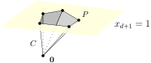

This chapter proves the equivalence between V- and H-polytopes. Our proof heavily relies upon the notion of cones.

# Cones

**Definition.**
A set $$C \subseteq \Real^d$$ is a *cone* if it is closed under *non-negative* scaling and addition. That is, for all $$\vec{c}, \vec{c}' \in C$$ and $$\lambda \geq 0$$, the vectors $$\lambda \vec{c}$$ and $$\vec{c} + \vec{c}'$$ again lie in $$C$$.

Similar to linear spaces, a cone contains the origin and looks flat. The major difference is that a cone grows asymmetrically to only one side, making the origin its "tip".

Our detour to cones is driven by the following consideration. An H-polytope is bounded by several affine spaces (hyperplanes, to be specific). The wise way to work with an affine space is to move the origin and reduce the problem to linear space. But the trick fails when we consider multiple affine spaces simultaneously, since they do not necessarily share a common point. With cones, however, we may twist the idea by establishing a correspondence between polytopes and cones (in the same flavour of the affine/linear space correspondence). This would then reduce the problem to cones -- although more complex than a linear space, it is still amenable.

One last definition: The *conic span* of vector set $$T = \set{\vec{t}_1, \dots, \vec{t}_n} \subseteq \Real^d$$ is defined as

$$ \cone(T) := \set{ \sum_{i=1}^n \lambda_i \vec{t}_i :~ \lambda_i \geq 0, \forall i }. $$

You are invited to check that $$\cone(T)$$ is indeed a cone.

# Homogenization

|            | V                     | H                                         |
| ---------- | --------------------- | ----------------------------------------- |
| polytope   | $$\conv(S)$$          | bounded intersection of halfspaces        |
| cone       | $$\cone(T)$$          | intersection of halfspaces through origin |

**The Main Theorem.**

1. V-polytope ⟺ H-polytope.
2. V-cone ⟺ H-cone.

*Proof of 1 assuming 2.* In the proof we elucidate the correspondence between polytopes and cones as suggested by the previous section. This is commonly referred to as *homogenization*.

(⟹)
Let $$P = \conv(\vec{s}_1, \dots, \vec{s}_n) \subseteq \Real^d$$ be a V-polytope, which is of course bounded. Define a V-cone

$$ C := \cone \begin{pmatrix}
    \vec{s}_1 & \cdots & \vec{s}_n \\
    1 & \cdots & 1 
\end{pmatrix} \subseteq \Real^{d+1}. $$

Here we invented a new dimension and lifted the defining points of $$P$$ (hence also the entire polytope) at height 1; see the illustration below.

{:.centering}

By geometric intuition we should be able to recover $$P$$ by slicing $$C$$ at height 1, that is

$$ P = \set{ \vec{p} \in \Real^d: \begin{pmatrix} \vec{p} \\ 1 \end{pmatrix} \in C }. \tag{$*$} $$

A formal proof is also easy:

$$ \begin{align*}
    \vec{p} \in P
    &\iff \exists \lambda_{1 \dots n} \geq 0: ~ \vec{p} = \sum_{i=1}^n \lambda_i \vec{s}_i, ~ 1 = \sum_{i=1}^n \lambda_i \\
    &\iff \exists \lambda_{1 \dots n} \geq 0: \begin{pmatrix} \vec{p} \\ 1 \end{pmatrix} = \sum_{i=1}^n \lambda_i \begin{pmatrix}\vec{s}_i \\ 1 \end{pmatrix} \\
    &\iff \begin{pmatrix} \vec{p} \\ 1 \end{pmatrix} \in C.
\end{align*} $$

(So the coefficients are corresponding between the polytope and the cone pictures, too.)

Next we invoke statement 2 to convert $$C$$ into H-cone, described by $$ C = \set{ \vec{x} \in \Real^{d+1}: A\vec{x} \leq \vec{0} }$$ for some matrix $$A \in \Real^{m \times (d+1)}$$. Then we use the relation ($$*$$) to recover an H-description of $$P$$. Denoting $$A =: (A_0, \vec{a})$$, we find

$$ P = \set{ \vec{p} \in \Real^d: A_0 \vec{p} \leq -\vec{a} }, $$

exactly an intersection of $$m$$ halfspaces in $$\Real^d$$.

(⟸)
Let $$P = \set{\vec{p} \in \Real^d: A \vec{p} \leq \vec{b}}$$ be an H-polytope, where $$A \in \Real^{m \times d}$$. Define an H-cone

$$ C := \set{ \begin{pmatrix} \vec{x} \\ x_{d+1} \end{pmatrix} \in \Real^{d+1}:~
x_{d+1} \geq 0, ~(A, -\vec{b}) \begin{pmatrix} \vec{x} \\ x_{d+1} \end{pmatrix} \leq \vec{0} }. $$

This may look abstract, but basically we again lifted the polytope to height 1 and extended its defining hyperplanes (which are now embedded in $$\Real^d \times \set{1}$$) to hyperplanes in $$\Real^{d+1}$$ through the origin. To grab the idea, let us slice $$C$$ at height 1 and recover (once more)

$$ P = \set{ \vec{p} \in \Real^d: \begin{pmatrix} \vec{p} \\ 1 \end{pmatrix} \in C }. \tag{$*'$} $$

We leave the verification as an easy exercise. (You may find the constraint $$x_{d+1} \geq 0$$ vacuous. Yes it is! We put it there only to simplify later argument.) Next we convert $$C$$ to V-cone via statement 2, described by $$C = \cone \set{\vec{t}_1, \dots, \vec{t}_n} \subseteq \Real^{d+1}$$. With appropriate rescaling and rearrangement, we assume without loss of generality that $$\vec{t}_1, \dots, \vec{t}_r$$ has last coordinate 1, while the remaining have last coordinate 0 (Why didn't we cover the case -1?). That is,

$$ C = \cone\begin{pmatrix}
    \vec{s}_1 & \cdots & \vec{s}_r & \vec{s}_{r+1} & \cdots & \vec{s}_n \\
    1 & \cdots & 1 & 0 & \cdots & 0
\end{pmatrix}. $$

Now we use ($$*'$$) to restore a V-description of polytope $$P$$:

$$ \begin{align*}
    \vec{p} \in P
    &\iff \begin{pmatrix} \vec{p} \\ 1 \end{pmatrix} \in C \\
    &\iff \exists \lambda_{1 \dots n} \geq 0: ~ \vec{p} = \sum_{i=1}^n \lambda_i \vec{s}_i, ~ 1 = \sum_{i=1}^r \lambda_i \\
    &\iff \vec{p} \in \conv \set{ \vec{s}_1, \dots, \vec{s}_r } + \cone \set{ \vec{s}_{r+1}, \dots, \vec{s}_n }.
\end{align*} $$

This does not match what we want. But wait: if the cone component contributed anything, then $$P$$ would contain a ray emanating to infinity, which contradicts with the presumed boundedness. Therefore, only the convex hull component exists, and the proof is finished. ∎

# V-Cone ⟺ H-Cone

This section proves statement 2 in the main theorem, namely V-cones and H-cones convert to each other. Speaking from a high level, we will "hard-convert" a V-cone (resp. H cone) to a higher-dimensional H-cone (resp. V-cone) and then inductively drop the extra dimensions, via either projection or intersection.

## V ⟹ H

We define the *projection* of point set $$S \subseteq \Real^{d+1}$$ onto the first $$d$$ axes to be

$$ \proj(S) := \set{ \vec{x} \in \Real^d: ~\exists x_{d+1}, \begin{pmatrix} \vec{x} \\ x_{d+1} \end{pmatrix} \in S }. $$

Given a V-cone $$C := \conv \set{\vec{t}_1, \dots, \vec{t}_n} \subseteq \Real^d$$, we define an H-cone

$$ D := \set{ (\vec{x}^\T, \lambda_1, \dots, \lambda_n)^\T \in \Real^{2d} :~ \vec{x} = \sum_{i=1}^n \lambda_i \vec{t}_i, ~\lambda_1, \dots, \lambda_n \geq 0 }. $$

It is really an H-cone because the equality constraint could be replaced by a pair of inequalities, and because no constant term is present.

Observe that $$ C = \proj \cdots \proj (D) $$ for $$d$$ repeated projections that eliminate the artificial coordinates. (For this reason, in standard literature our "projection" is termed "elimination".) Therefore, the whole thing boils down to a quite intuitive claim:

**Claim.**
If $$D$$ is an H-cone then $$\proj(D)$$ is also an H-cone. (This holds for generic $$D$$, not necessarily the one we defined earlier.)

*Proof.*
We will use a trick called *Fourier-Motzkin elimination*, an analogue to Gauss elimination in the world of inequalities. Suppose $$D$$ is described by

$$ \begin{pmatrix}
    \vec{a}_1^\T & a_{1,d+1} \\
    \vdots & \vdots \\
    \vec{a}_m^\T & a_{m,d+1}
\end{pmatrix} \vec{x} \leq \vec{b}. $$

Without loss of generality we assume

$$ a_{i,d+1} = \begin{cases}
    1 & i \in [\ell], \\
    -1 & i \in [\ell+1, r], \\
    0 & i \in [r+1, m].
\end{cases} $$

For the moment let us fix the values of $$x_1, \dots, x_d$$ and solve for $$x_{d+1}$$. The head block of the inequalities produces upper bounds, the middle block yields lower bounds, and the tail block returns basically true or false. $$x_{d+1}$$ has a solution (under our choice of $$x_1, \dots, x_d$$) iff all upper bounds are no less than all lower bounds, and that the tail block returns all true.

Now we play the same game for *symbolic* $$x_1, \dots, x_d$$ and solve for $$x_{d+1}$$. It has a solution iff the following system is feasible: Generate inequalities that enforces the ≤ relation on all (lower bound, upper bound) combinations, then append the tail block as is. The resulting system $$\Gamma$$ has $$\ell \cdot (r-\ell) + (m-r)$$ constraints but only $$d$$ variables, and it perfectly describes $$\proj(D)$$. Therefore, the projection is indeed an H-cone. ∎

## H ⟸ V

We approach the converse in a similar fashion. Define the *slice* of $$S \subseteq \Real^{d+1}$$ at level $$x_{d+1} = 0$$ to be

$$ \slice(S) := \set{ \vec{x} \in \Real^d: ~\begin{pmatrix} \vec{x} \\ 0 \end{pmatrix} \in S }. $$

Suppose $$C := \set{ \vec{x} \in \Real^d: ~ A \vec{x} \leq \vec{0} }$$ is an H-cone where $$A = (\vec{a}_1, \dots, \vec{a}_d) \in \Real^{m \times d}$$. We define a V-cone

$$ D := \set{ \begin{pmatrix} \vec{x} \\ \vec{y} \end{pmatrix} \in \Real^{d+m}: ~ A \vec{x} \leq \vec{y} }. $$

which unfortunately debuted as an H-cone. Nevertheless, one may immediately restore $$ C = \slice \cdots \slice(D)$$ for $$m$$ repeated slices. Now we unveil the V-description of $$D$$:

$$ D = \cone(T) := \cone \set{
    \pm \begin{pmatrix} \vec{e}_1 \\ \vec{a}_1 \end{pmatrix},
    \dots,
    \pm \begin{pmatrix} \vec{e}_d \\ \vec{a}_d \end{pmatrix},
    \begin{pmatrix} \vec{0} \\ \vec{e}_1 \end{pmatrix},
    \dots,
    \begin{pmatrix} \vec{0} \\ \vec{e}_d \end{pmatrix}
} $$

where the $$\vec{e}_i$$'s are the standard unit basis. Let us do the algebra right away:

$$ \begin{align*}
    &\quad \begin{pmatrix} \vec{x} \\ \vec{y} \end{pmatrix} \in \cone(T) \\
    &\iff \exists \lambda_{1 \dots 3d} \geq 0: ~
        \begin{pmatrix} \vec{x} \\ \vec{y} \end{pmatrix}
        = \sum_{i=1}^d (\lambda_i - \lambda_{d+i}) \begin{pmatrix} \vec{e}_i \\ \vec{a}_i \end{pmatrix}
        + \sum_{i=2d}^{3d} \lambda_i \begin{pmatrix} \vec{0} \\ \vec{e}_i \end{pmatrix} \\
    &\iff \exists \beta_{1 \dots d} \in \Real, ~\vec{0} \leq \vec{z} \in \Real^d: ~
        \begin{pmatrix} \vec{x} \\ \vec{y} \end{pmatrix}
        = \sum_{i=1}^d \beta_i \begin{pmatrix} \vec{e}_i \\ \vec{a}_i \end{pmatrix}
        + \begin{pmatrix} \vec{0} \\ \vec{z} \end{pmatrix} \\
    &\iff \exists \vec{0} \leq \vec{z} \in \Real^d: ~\vec{y} = \sum_{i=1}^d x_i \vec{a}_i + \vec{z} \\
    &\iff \begin{pmatrix} \vec{x} \\ \vec{y} \end{pmatrix} \in D.
\end{align*} $$

There is nothing special behind the scenes. One may view $$D$$ as the solution space of $$A \vec{x} - \vec{y} = \vec{0}$$ *plus* the freedom of raising $$\vec{y}$$ arbitrarily high above. The first half of our conic span (the ± vectors) is a basis for the solution space of the equation, while the second half allows $$\vec{y}$$ to move above.

Given what we have shown so far, it remains to prove the following.

**Claim.**
If $$D$$ is a V-cone then $$\slice(D)$$ is also a V-cone.

*Proof.*
As usual, assume without loss of generality that

$$D = \cone \begin{pmatrix}
    \vec{s}_1 & \cdots & \vec{s}_\ell & \vec{s}_{\ell+1} & \cdots & \vec{s}_r & \vec{s}_{r+1} & \cdots & \vec{s}_n \\
    1 & \cdots & 1 & -1 & \cdots & -1 & 0 & \cdots & 0
\end{pmatrix} \subseteq \Real^{d+1}. $$

We define a vector set that "mixes" the first two blocks and copies the last block:

$$T := \set{\vec{s}_i + \vec{s}_j: ~ i \in [\ell],~ j \in [\ell+1, r]} \cup \set{\vec{s}_k: ~ k \in [r+1, n]} \subseteq \Real^d.$$

This has a similar flavour to Fourieer-Motzkin elimination, and we boldly assert $$\slice(D) = \cone(T)$$. Once proven, it will conclude the claim.

There should be no doubt of the ⊇ inclusion, since (1) $$T \subseteq \slice(D)$$; (2) $$\slice(D)$$ is closed under non-negative scaling and addition.

For the ⊆ inclusion, we take an arbitrary $$\vec{x} \in \slice(D)$$ and write, for some non-negative coefficients,

$$ \begin{pmatrix} \vec{x} \\ 0 \end{pmatrix}
    = \sum_{i=1}^{\ell} \lambda_i \begin{pmatrix} \vec{s}_i \\ 1 \end{pmatrix}
    + \sum_{j=\ell+1}^{r} \lambda_j \begin{pmatrix} \vec{s}_j \\ -1 \end{pmatrix}
    + \sum_{k=r+1}^{n} \lambda_k \begin{pmatrix} \vec{s}_k \\ 0 \end{pmatrix}. $$ 

This implies $$\sum_{i=1}^{\ell} \lambda_i = \sum_{j=\ell+1}^r \lambda_j =: \Lambda$$, and

$$\begin{align*}
    \vec{x}
    &= \sum_{i=1}^{\ell} \lambda_i \vec{s}_i + \sum_{j=\ell+1}^{r} \lambda_j \vec{s}_j + \sum_{k=r+1}^n \lambda_k \vec{s}_k \\
    &= \sum_{i=1}^{\ell} \sum_{j=\ell+1}^r \frac{\lambda_i \lambda_j}{\Lambda} (\vec{s}_i + \vec{s}_j) + \sum_{k=r+1}^n \lambda_k \vec{s}_k
    \quad \in \cone(T)
\end{align*}$$

just as desired. ∎

*Remark.* We want to point out that the construction of $$T$$ is natural. As you have seen, vector $$\vec{x} \in \slice(D)$$ has the distinctive feature that the sum of its "head-block coefficients" equals the sum of "middle-block coefficients". In order to enforce this feature, the $$T$$ must pair up the head block with the middle block so that the weights on both blocks are synchronised.
