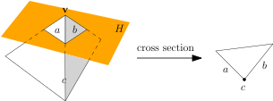
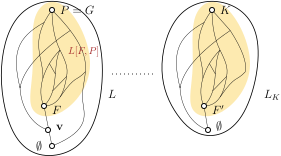

The main theorem gives us a global picture of a polytope, but the details remain vague when we zoom in. Many fundamental questions arise:

- What do the faces of a polytope look like?
- Are the number of faces finite?
- How are the faces connected to each other?
- ...

This chapter takes a glimpse on these questions. Throughout we consider the polytope $$P := \conv(S)$$ with vertex set $$V$$. Denote $$n := \lvert V \rvert$$.

# Basic Properties of Faces

## Vertices

**Lemma 5.**
Assume $$\vec{p} \in P$$. Then $$\vec{p} \in V \iff \vec{p} \not\in \conv(S \setminus \set{\vec{p}})$$.

*Proof.*
Denote $$R = \set{\vec{r}_1, \dots, \vec{r}_\ell} := S \setminus \{\vec{p}\}$$; note that $$\vec{p}$$ need *not* be in $$S$$.

$$\begin{align*}
    \vec{p} \not\in \conv(R)
    &\iff \not\exists \vec{x} \geq \vec{0}: ~\begin{pmatrix}
        \vec{r}_1 & \cdots & \vec{r}_\ell \\
        1 & \cdots & 1
    \end{pmatrix} \vec{x} = \begin{pmatrix}
        \vec{p} \\ 1
    \end{pmatrix} \\
    &\overset{\text{Farkas II}}{\iff} \exists (\vec{h},h_0): ~
    \forall i \in [\ell], ~\vec{h}^\T \vec{r}_i + h_0 \geq 0, ~\vec{h}^\T \vec{p} + h_0 < 0
\end{align*}$$

The last condition basically says that there is a hyperplane $$H: \vec{h}^\T \vec{x} + h_0 = 0$$ separating $$R$$ and $$\vec{p}$$.

Assuming the condition, we go forward and show $$\vec{p} \in V$$. Not much work actually. We increase $$h_0$$ until the "<" becomes "="; the "≥" will also switch to ">". This corresponds to shifting the hyperplane $$H$$ until it hits $$\vec{p}$$, by which time $$R$$ is *strictly* contained on its positive side. In particular the polytope $$P = \conv(R \cup \set{\vec{v}})$$ is also on the positive side. It remains to show $$P \cap H = \set{\vec{p}}$$. To this end, for any point $$\vec{q} := \sum_{\vec{s} \in S} \lambda_{\vec{s}} \vec{s} \in P$$ distinct from $$\vec{p}$$, there must exist some $$\vec{r} \in R$$ contributing $$\lambda_{\vec{r}} > 0$$. But then $$\vec{q} \not\in H$$ since $$\vec{r} \not\in H$$.

The converse direction is essentially moving backwards line by line. We leave the verification to the reader. ∎

**Corollary 6.**

- $$V \subseteq S$$ (so the vertex set is always finite as expected!);
- yet $$\conv(V) = P$$ (so the vertex set is the most concise V-description).

*Proof.*

- If not, we take $$\vec{p} \in V \setminus S$$ and find $$\vec{p} \not\in \conv(S \setminus \set{\vec{p}}) = \conv(S) = P$$ by Lemma 5, which is absurd.
- Whenever there exists $$\vec{p} \in S \cap \conv(S \setminus \set{\vec{p}})$$, we eject it from the set $$S$$. The ejection does not change $$\conv(S) = P$$. (Why?) Eventually any point in $$S$$ satisfies the condition in Lemma 5, thus is a vertex. Hence $$\conv(V) \supseteq P$$. The reverse inclusion is trivial. ∎

## General Faces

**Lemma 7.**
Every face $$F$$ of $$P$$ is a polytope. Moreover, we can easily write down its

- **V-description:** $$F = \conv(V \cap F)$$;
- **vertex set:** $$V \cap F$$;
- **face set:** $$\set{G: \text{a face of }P,~ G \subseteq F}$$.

*Proof.*
Using H-description, the intersection of $$P$$ with any hyperplane is still an H-polytope. So in particular every face is a polytope.

For the remainder of the proof, assume $$F = P \cap H$$ for some supporting hyperplane $$H: \vec{h}^\T \vec{x} + h_0 = 0$$. We denote $$V' := V \cap F = V \cap P \cap H = V \cap H$$.

- The ⊇ inclusion is obvious. For the ⊆ inclusion, suppose to the contrary that $$\exists \vec{p} \in F \setminus \conv(V') \subseteq \conv(V) \setminus \conv(V')$$. So when expressing $$\vec{p}$$ as a convex combination of $$V$$ we must *use* some vector $$\vec{v} \in V \setminus V'$$. By "use" we mean the corresponding coefficient is strictly positive. Since $$\vec{v} \not\in H$$, we obtain $$\vec{p} \not\in H$$, contradicting the construction. 
- By Lemma 5 we know every point in $$V'$$ is a vertex. Linking with what we proved just now, this gives the complete vertex set.
- Let $$G$$ be any face of polytope $$P$$ such that $$G \subseteq F$$, supported by $$H_G$$. Then of course $$H_G$$ still supports $$G$$ as a face of $$F$$. The converse direction needs a twist. Let $$G$$ be a face of $$F$$, supported by $$H_G: \vec{g}^\T \vec{x} + g_0 = 0$$. The potential issue is that $$H_G$$ might not respect the global polytope, i.e. it could "cut through" $$P$$. Geometrically we can fix this by "rotating" it round "axis" $$G$$ until the entirety of $$P$$ lies on one side. Algebraicly the idea neatly writes $$\Lambda: (\vec{g} + \lambda \vec{h})^\T \vec{x} + (g_0 + \lambda h_0) = 0$$. Clearly $$G = F \cap \Lambda$$. By choosing the constant $$\lambda$$ large enough the hyperplane is almost $$H_F$$ and the entire polytope (except $$F$$) *strictly* lies on one side, so $$G = P \cap \Lambda$$ as desired. ∎

**Corollary 8.**
The total number of faces is at most $$2^n$$.

*Proof.*
Because each face $$F$$ identifies a vertex set $$V(F) \in 2^V$$ and the mapping is injective. (*Remark*: in general it is not surjective.) ∎

In fact the argument could be extended to bound the number of faces in a specific dimension:

**Proposition 9.** 
The number of $$i$$-dimensional faces is at most $$\binom{n}{i+1}$$. Consequently, the total number of faces is upper bounded by $$\sum_{i=-1}^{d} \binom{n}{i+1} = O(n^d)$$ provided $$\dim(P) \leq d$$.

*Proof.*
First we note that if $$\dim(F) = i$$ then $$\lvert V(F) \rvert \geq i+1$$. This is proved by

$$ i = \dim(\aff(F)) = \dim(\aff \conv(V(F))) = \dim(\aff(V(F))) $$

and using Corollary 3. So we could map $$F$$ to an affinely independent vertex (sub)set $$\Psi(F) \subseteq V(F): ~\lvert \Psi(F) \rvert = i+1$$. We ask you to check that $$\Psi$$ is injective. ∎

**Lemma 10.**
Let $$F, G$$ be two faces. Then $$F \cap G$$ is again a face with vertex set $$V(F) \cap V(G)$$.

*Proof.*
To show that $$F \cap G$$ is a face, we mix the supporting hyperplanes of $$F$$ and $$G$$ (just as we did in Lemma 7) to get a supporting hyperplane of $$F \cap G$$. The detail is left as an exercise. The claim on vertex set follows easily from Lemma 7:

$$ V(F \cap G) = V \cap F \cap G = (V \cap F) \cap (V \cap G) = V(F) \cap V(G). ∎$$

## Application

**Exercise.**
Prove that a $$k$$-simplex has $$2^{k+1}$$ faces. (*Hint*: Find out the facets, then use Lemma 10 to generate other faces.)

# The Face Lattice

There are some subtle questions that we did not touch:

- Starting from the facets, we can take all possible intersections and generate a long list of faces (as we did in the last exercise). Is the list *complete* in general?

- Does the face set have a full spectrum of dimensions? In other words, is there an $$i$$-dimensional face for *all* $$i \leq \dim(P)-1$$?

- How do the dimensions of faces relate?

They point us to study a whole hierarchy of faces, namely the *face lattice*. We begin with some poset theory.

**Definition.**
A lattice $$(L, \leq)$$ is a partially ordered finite set with the following properties:

- **bounded:** there exist a unique maximal element $$\top$$ and a unique minimal element $$\bot$$;
- **unique meet:** all $$x,y \in L$$ have a unique maximal common lower bound, denoted as $$x \land y \in L$$;
- **unique join:** all $$x,y \in L$$ have a unique minimal common upper bound, denoted as $$x \lor y \in L$$.

**Exercise.**
Show that

- $$\top, \bot$$ are the *maximum* and *minimum* elements respectively. That is, they are actually comparable to all elements in the lattice.
- The third requirement ("unique join") is implied by the other two.

Fix a lattice $$L$$, we shall use the shorthand $$L[a,b] := \set{z \in L: ~a \leq z \leq b}$$. Observe that it is a lattice, too. We call a lattice *graded* if every maximal chain in it has the same length; the property clearly carries to every sub-lattice $$L[a,b]$$ as well. Hence we could define the *height* $$h(x)$$ of an element $$x \in L$$ as *the* length of maximal chain in $$L[\bot, x]$$. Naturally, $$h(L) := h(\top)$$.

A graded lattice has a highly layered structure. In its Hasse diagram, an arc always points from one layer to the layer immediately above.

Now we are ready to state an important structural theorem on face hierarchy.

**Theorem 11.**
Let $$L$$ be the face set of polytope $$P$$, then $$(L, \subseteq)$$ is a graded lattice with minimal element $$\emptyset$$ and maximal element $$P$$. Moreover, for faces $$F,G \in L$$,

- $$F \land G = F \cap G$$;
- There exists polytope $$Q$$ with $$\dim(Q) = \dim(G) - \dim(F) - 1$$ whose face lattice is isomorphic to $$L[F,G]$$.
- $$h(L[F,G]) = \dim(G) - \dim(F) + 1$$; in particular $$h(F) = \dim(F) + 2$$.

*Proof sketch.*
We sacrifice some formality to convery the main idea. But to this point, we have gained sufficient experiences to fill out a complete proof.

The maximum and minimum elements should not need explanation. To see the "unique meet" property, note $$F \cap G$$ is bigger than (i.e. contains) any face that are smaller than (i.e. contained in) both $$F$$ and $$G$$. Since $$F \cap G \in L$$ by Lemma 10, it is the unique meet we are looking for. These facts proves that $$L$$ is a lattice.

Next we move on to attack the second item. A simplifying assumption is on track. We know that $$L[\emptyset,G]$$ is a lattice, but it is not only an arbitrary lattice. It is *the face lattice* of $$G$$ by Lemma 7. Therefore, we may assume $$P = G$$ without changing the structure of the interval under inspection.

Then we proceed by induction on $$\dim(F)$$. In the base case $$\dim(F) = -1$$ (i.e. $$G = \emptyset$$), the claim is clear. In the induction step, we take an arbitrary vertex $$\vec{v} \in V \cap F$$ and "cut it off" from $$P$$ by a sufficiently close hyperplane $$H$$. The cross section $$K := P \cap H$$ is again a polytope. Its faces one-one correspond to the faces in $$P$$ that touch $$\vec{v}$$; even more importantly, they are one-dimensional lower. (See the illustration below.)

{:.centering}

Hence $$L[\set{\vec{v}}, P]$$ is isomorphic to the face lattice of $$K$$, which we denote as $$L_K$$. Since $$L[\set{v},P] \supseteq L[F,P]$$, the lattice $$L_K$$ contains an isomorphic copy of $$L[F,P]$$ -- but again, the counterpart of $$F$$ in $$L_K$$ is "one level closer" to the bottom. So we may apply induction hypothesis to conclude.

{:.centering}

Finally we may prove by easy induction that the lattice is graded and has the height function as described. ∎

As an immediate consequence, we know that every $$i$$-dimensional face can be generated by intersection of two $$(i+1)$$-dimensional faces. So the set of all facets of a polytope actually encodes a complete description of *all faces*! With little work we see the following:

**Corollary 12.**
A polytope is simplicial as long as all its *facets* are simplices.

*Proof.*
By what we discussed just now, any face can be generated by intersections of facets -- which by assumption are simplices. Using Lemma 7, the vertex set of any face consists of affinely independent points, so the face is a simplex. ∎

