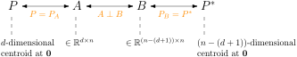
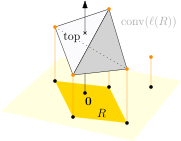
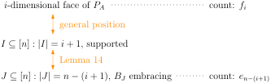

How many faces can a polytope in $$\Real^d$$ with $$n$$ vertices have? We collected two preliminary upper bounds last time:

- \#faces $$\leq 2^n$$;
- \#faces $$= O(n^d)$$.

But in 2D and 3D we have much better bounds. A two-dimensional polytope (i.e. polygon) always has $$O(n)$$ faces. A three-dimensional polytope corresponds to a planar graph (imagine taking away a facet and dragging its boundary outwards until "everything else is encompassed" so that we could flatten the structure), and again \#faces is $$O(n)$$. Does this behaviour continues in higher dimensions? 

Unfortunately no. In high dimensions live monsters. Cyclic polytopes are on the list.

# Faces of Cyclic Polytope

Recall that the moment curve $$\Phi: \Real \to \Real^d$$ is defined as $$\Phi(t) := (t, t^2, \dots, t^d)^\T$$, and a cyclic polytope is the convex hull of some distinct points on the curve, namely $$P := \conv(T) = \set{\Phi(t_1), \dots, \Phi(t_n)}$$. The observation below formalises that the moment curve is far from being "flat".

**Observation.**
Any $$d+1$$ of these defining points are affinely independent.

*Proof.*
Take any $$d+1$$ defining points $$\set{\Phi(s_1), \dots, \Phi(s_{d+1})} \subseteq T$$. By the "equality part" of Corollary 3 it suffices to prove that the matrix 

$$\begin{pmatrix}
    \Phi(s_1) & \cdots & \Phi(s_{d+1}) \\
    1 & \cdots & 1
\end{pmatrix}$$

has full rank. But this is nothing but the Vandermonde matrix, whose determinant is non-zero because $$s_1, \dots, s_{d+1}$$ are distinct. ∎

**Corollary.**
Cyclic polytopes are simplicial.

*Proof.*
Every facet contains at least $$d$$ defining points. But it cannot contain $$d+1$$ many due to our observation. So every facet is a simplex and we may conclude by Corollary 12. ∎

Now we have a feeling that a cyclic polytope could have many faces. But it does not stop the astonishment brought by the following theorem:

**Theorem.**
In a cyclic polytope, *every* subset of $$\leq \lfloor d/2 \rfloor$$ many defining points forms (i.e. "convex spans") a face. Hence the total number of faces is $$\Omega(n^{d/2})$$.

*Proof.*
Take any defining points $$S := \set{ \Phi(s_1), \Phi(s_3), \dots, \Phi(s_{2\ell-1}) } \subseteq T$$ where $$\ell \leq \lfloor d/2 \rfloor$$ and $$s_1 < s_3 < \cdots < s_{2\ell-1}$$. We interpolate a number between every adjacent pair, and then populate the sequence to length $$d$$:

$$ s_1 < \underline{s_2} < s_3 < \underline{s_4} < \cdots < s_{2\ell-1} < \underline{s_{2\ell}} < \underline{s_{2\ell+1} < \cdots < s_d}. $$ 

Here we ensure

- for all $$i \in [\ell]$$ the interval $$(s_{2i-1}, s_{2i}]$$ contains no $$t_j$$'s;
- $$s_{2\ell+1}$$ is larger than all $$t_j$$'s.

We claim that the hyperplane

$$H: \begin{vmatrix}
    \vec{x} & \Phi(s_1) & \cdots & \Phi(s_d) \\
    1 & 1 & \cdots & 1
\end{vmatrix} = 0$$

supports a face $$\conv(S)$$. To this end, we inspect the univariate polynomial

$$ p(x) := \begin{vmatrix}
    \Phi(x) & \Phi(s_1) & \cdots & \Phi(s_d) \\
    1 & 1 & \cdots & 1
\end{vmatrix}. $$

Clearly it vanishes iff $$x = s_1, \dots, s_d$$ by construction. Furthermore, all the $$p(t_j)$$'s have the same sign because of our interpolation scheme and continuity.

{:.centering}

From here we see

- $$T$$ stays on one side of $$H$$; so is the polytope $$P = \conv(T)$$.
- $$T \cap H = S$$, so $$V \cap H \subseteq S$$ (Corollary 6) and the face is $$\conv(V \cap H) = \conv(S)$$ (Lemma 7).

So the proof is complete. ∎

**Corollary.**
The vertex set is exactly $$T$$. ∎

The theorem does not cover faces of dimension higher than $$d/2$$; in particular it reveals no information about the facets. In fact, we may use the same idea to discuss facets; see the exercise.

**Exercise.**
Prove the following theorem, known as Gale's evenness condition:

> Let $$S := \set{ \Phi(s_1), \dots, \Phi(s_d) } \subseteq T$$ where $$s_1 < \cdots < s_d$$. It forms a facet iff the number of $$t_j$$'s in the interval $$(s_i, s_{i+1})$$ is even, for all $$i \in [d-1]$$.

# McMullen's Upper Bound Theorem

Now we have narrowed the gap between lower bound $$\Omega(n^{d/2})$$ and upper bound $$O(n^d)$$. What is the true answer? In a strikingly elegant result, McMullen showed that *cyclic polytope is the worst monster*. In other words, every polytope can have up to $$O(n^{d/2})$$ many faces.

Our proof plan:

- Transform, via linear algebra, the polytope $$P \subseteq \Real^d$$ to a dual polytope $$P^* \subseteq \Real^{n-(d+1)}$$.
- Establish a bijection between faces in $$P$$ and some (more manageable) geometric objects in $$P^*$$.
- Count those objects in the dual picture, using fancy combinatorial arguments.

## Gale duality

We will dive into linear algebra temporarily. Any matrix $$A = (\vec{a}_1, \dots, \vec{a}_n) \in \Real^{m \times n}$$ induces a polytope $$P_A := \conv \set{\vec{a}_1, \dots, \vec{a}_n} \subseteq \Real^m$$. We say $$A$$ is *compliant* if

- $$P_A$$ has full dimension, i.e. $$\dim(P_A) = m$$; and
- $$P_A$$ is centered at origin, i.e. $$\frac{1}{n} \sum_{i=1}^n \vec{a}_i = \vec{0}$$.

If we want to study the structure of a particular polytope $$P$$, we may set the ambient space to $$\aff(P) \cong \Real^{\dim(P)}$$ in which $$P$$ has full dimension. Then, with appropriate shifting $$P$$ can be centered at origin. So we could always find a matrix $$A \in \Real^{\dim(P) \times n}$$ with $$P_A = P$$. In this sense, compliant matrices are expressive as any other matrices.

The compliance condition can be restated in many other ways. Algebraic ones come handy for our purpose: 

**Exercise.**
Show that the three statements are equivalent:

1. $$A$$ is compliant;
2. $$\rank \begin{pmatrix} A \\ \vec{1}^\T \end{pmatrix} = m+1$$ and $$A \vec{1} = \vec{0}$$;
3. $$\rank(A) = m$$ and $$A \vec{1} = \vec{0}$$.

Now we state the notion of orthogonal duality (also known as Gale duality).

**Definition.**
Let $$A \in \Real^{d \times n}$$ and $$B \in \Real^{(n-(d+1)) \times n}$$ be compliant matrices. We say they are *orthogonal dual* to each other, denoted $$A \perp B$$, if $$AB^\T = O$$.

**Lemma 13.**
Every compliant matrix $$A$$ has an orthogonal dual. In fact, the dual is unique up to linear transformation.

*Proof.*
Denote $$A^+ := \begin{pmatrix} A \\ \vec{1}^\T \end{pmatrix}$$. Since $$A$$ is compliant, we have $$\rank(A^+) = d+1$$ by the exercise. So $$\mathrm{ker}(A^+)$$ has dimension $$n-(d+1)$$ and we collect a basis $$B^\T := (\vec{b}_1, \dots, \vec{b}_{n-(d+1)})$$. Note that $$B \in \Real^{(n-(d+1)) \times n}$$ has our desired dimension. It is straightforward to check (using the fact that $$B$$ is a basis of kernel of $$A^+$$)

- $$\rank(B) = n-(d+1)$$;
- $$B \vec{1} = \vec{0}$$;
- $$AB^\T = O$$.

So $$B$$ is a compliant matrix and moreover an orthogonal dual of $$A$$. (And it should be clear that all orthogonal duals of $$A$$ are full-rank creatures in $$\mathrm{ker}(A)$$, so they are the same up to linear transformation.) ∎

The procedure of Gale duality transform is depicted as follows:

{:.centering}

Of course, the implementation of each step is up to you. But let us just fix our favourite implementation, as the argument below does not care.

## Embracing sets

Next we describe the counterpart of faces in the dual picture. From now on we denote $$m := n - (d+1)$$ to avoid clutter. We also assume implicitly that all things we consider are in general position to get rid of some details.

**Definition.**
We call a set $$S \subseteq \Real^m$$ *embracing* if $$\vec{0} \in \conv(S)$$.

**Lemma 14.**
Let $$A = (\vec{a}_1, \dots, \vec{a}_n)\in \Real^{d \times n}$$ and $$B = (\vec{b}_1, \dots, \vec{b}_n) \in \Real^{m \times n}$$ be orthogonal duals. Then for any $$I \subseteq [n]$$, $$A_I := (\vec{a}_i)_{i \in I}$$ forms a face of $$P_A$$ iff $$B_{\overline{I}} := (\vec{b}_i)_{i \not\in I}$$ is embracing.

*Proof.*

(⟹)
Let $$\vec{h}^\T \vec{x} + h_0 = \vec{0}$$ be the supporting hyperplane for face formed by $$A_I$$. That is, $$\vec{h}^\T \vec{a}_i + h_0 \geq 0$$ with equality iff $$i \in I$$. We write it in a more concise way:

$$ \Lambda := A^\T \vec{h} + h_0 \vec{1} \geq \vec{0}. $$

Since $$\Lambda \neq \vec{0}$$, we may rescale it to encode covex coefficients. Then 

$$ B \Lambda = BA^\T \vec{h} + h_0 B\vec{1} = \vec{0} $$

by properties of orthogonal dual. This shows $$\vec{0} \in \conv(B_{\overline{I}})$$ since $$\Lambda$$ is zero at coordinates $$I$$.

(⟸)
Assume $$B \Lambda = \vec{0}$$ for some $$\Lambda \geq 0$$ with zeros at coordinates $$I$$. So $$\Lambda \in B^{\perp}$$, the orthogonal complement of $$B$$. Since $$(A^\T, \vec{1})$$ is a basis for $$B^{\perp}$$ (as is clear from the proof of Lemma 13), we must conclude

$$ \Lambda = (A^\T, \vec{1}) \begin{pmatrix} \vec{h} \\ h_0 \end{pmatrix} = A^\T \vec{h} + h_0 \vec{1} $$

for some $$\vec{h}, h_0$$. Then $$\vec{h}^\T \vec{x} + h_0 = 0$$ is exactly the desired supporting hyperplane. ∎

With Lemma 14, we can turn to count the embracing sets in the dual picture.

## Counting embracing sets

Define $$e_k := \# \text{embracing } R \in \binom{B}{k}$$. The perhaps most brilliant idea is to invent a new dimension, lift the points up, and identify each embracing subset with a simplex in the lifted picture.

- Let $$\ell: \Real^m \to \Real^{m+1}$$ be a "lifting map" that preserves the first $$m$$ coordinates. (One may think of it as appending a coordinate to the input.) We **lift** each point $$\vec{b} \in B$$ straight up to $$\ell(\vec{b})$$. The only requirement is that any $$m+2$$ points after the lifting are affinely independent. Besides that, you may design whatever lifting you want!
- For each embracing set $$R$$, we look at the polytope $$\conv(\ell(R)) \subseteq \Real^{m+1}$$ in the lifted picture. The ray $$\set{\vec{x} \in \Real^{m+1}: x_{m+1} \geq 0}$$, radiating from the origin straight up, must intersect the polytope somewhere due to the embracing property. We **identify** the top facet of the polytope as the "witness" of $$R$$. By "top" we mean the entire polytope is below the affine span of the facet. Note that
    - the top facet is one that the ray hits last;
    - so it is unique due to general position assumption;
    - it is an $$m$$-simplex due to the affine independence requirement of the lifting;
    - equivalently we may represent it by its "projected vertex set" $$\Delta \in \binom{B}{m+1}$$, which is an embracing set.

{:.centering}

Now we do a double counting argument. Each embracing set identifies a unique embracing set $$\Delta \in \binom{B}{m+1}$$; conversely, for each embracing $$\Delta \in \binom{B}{m+1}$$, how many times it gets identified?

A direct answer might be difficult. But let us define a helper quantity. Let $$\beta_{\Delta}$$ be the number of $$\vec{b} \in B$$ whose lifting $$\ell(\vec{b})$$ is below $$\aff(\ell(\Delta))$$. Then $$\Delta$$ is identified by exactly $$\binom{\beta_{\Delta}}{k-m-1}$$ many embracing sets of size $$k$$. So we can count

$$ e_k = \sum_{\text{embracing }\Delta \in \binom{B}{m+1}} \binom{\beta_{\Delta}}{k-m-1} = \sum_{i=0}^{n-m-1} \binom{i}{k-m-1} h_i, \tag{$*$} $$

where we grouped $$h_i := \# \text{embracing } \Delta \in \binom{B}{m+1}: \beta_\Delta = i$$.

So the problem reduces to upper bounding $$h_i$$'s. Also, observe that it gives a triangular linear system, so $$h_{0 \dots n-m-1}$$ and $$e_{0 \dots n}$$ *uniquely* determine each other. ($$e_{0 \dots m+1}$$ are always zero due to general position assumption.) It means that $$h_{0 \dots n-m-1}$$ are *independent* of the lifting map! Therefore, we could freely tailor the lifting map to our needs. The cute proposition below, though not quite useful for us, nicely illustrates the idea.

**Proposition 15.**
$$h_i \geq 1$$ for all $$i \in [n-m-1]$$. Consequently $$e_k \geq \binom{n-m}{k-m}$$.

*Proof.*
Since $$B \vec{1} = \vec{0}$$, we know $$\vec{0} \in \conv(B)$$, so in particular there exists an embracing $$\Delta \in \binom{B}{m+1}$$ by Carathéodory's theorem. Now we design the lifting map so that $$\beta_\Delta = i$$; this proves $$h_i \geq 1$$. We may design different maps for different $$i$$'s, and repeat the same argument. Plugging this into ($$*$$) and simplify, we get a lower bound for $$e_k$$. ∎

Now comes the real business. We will prove three properties of the $$h_i$$'s, which then easily leads to an upper bound.

**Lemma 16.**
The counts have symmetry $$h_i = h_{n-m-i-1}$$.

*Proof.*
We replay the whole argument but replacing "top" with "bottom". We call the (new) counters $$h_i'$$. Using the same lifting map, we see $$h_i' = h_{n-(m+1+i)}$$ because "$$i$$ points below" is the same as "$$n-(m+1+i)$$ points above". But on the other hand $$h_{0 \dots n-m-1}'$$ is determined by $$e_{0 \dots n}$$ via a counterpart relation of ($$*$$), so $$h_i' = h_i$$. Combining the two concludes the proof. ∎

**Lemma 17.**
Removing a point from $$B$$ does not increase the counts: $$h_i(B \setminus \set{\vec{b}}) \leq h_i(B)$$.

*Proof.*
Let us see what happens to an embracing $$\Delta \in \binom{B}{m+1}$$ after we remove $$\vec{b} \in B$$.

- If $$\vec{b} \in \Delta$$ then $$\Delta$$ is killed;
- If $$\ell(\vec{b})$$ is below $$\aff(\ell(\Delta))$$, then $$\beta_\Delta$$ decreases by 1;
- Otherwise there is no effect.

So the count $$h_i$$

- decreases 1 for every $$\Delta: \beta_{\Delta} = i$$ with $$\vec{b}$$ below or contained;
- increases 1 for every $$\Delta: \beta_{\Delta} = i+1$$ with $$\vec{b}$$ below.

Counting the cases individually is feasible but tiring. Instead, we exploit the flexibility of lifting map: Design the lifting so that $$\vec{b}$$ is sufficiently high above, and the "increase" case simply cannot happen. ∎

**Lemma 18.**

$$\sum_{\vec{b} \in B} h_{i-1}(B \setminus \set{\vec{b}}) = (n-m-i) \cdot h_{i-1}(B) + i \cdot h_i(B).$$

*Proof.*
For an embracing $$\Delta \in \binom{B}{m+1}$$, we inspect how many times it was counted towards LHS:

- If $$\beta_{\Delta}(B) = i-1$$, then $$\beta(\Delta)(B \setminus \set{\vec{b}}) = i-1$$ iff the proposed removal $$\vec{b}$$ is above $$\Delta$$ in the lifting. Hence, $$\Delta$$ is counted for exactly $$n - (m+1+i-1) = n-m-i$$ times.
- If $$\beta_{\Delta}(B) = i$$, then $$\beta(\Delta)(B \setminus \set{\vec{b}}) = i-1$$ iff the proposed removal $$\vec{b}$$ is below $$\Delta$$ in the lifting. Hence, $$\Delta$$ is counted for exactly $$i$$ times.
- In all other cases, $$\beta(\Delta)(B \setminus \set{\vec{b}}) \neq i-1$$. ∎

**Theorem 19.**
$$h_i \leq \min \set{\binom{m+i}{m}, \binom{n-i-1}{m}}$$.

*Proof.*
We write

$$\begin{align*}
    (n-m-i) \cdot h_{i-1}(B) + i \cdot h_i(B)
    &= \sum_{\vec{b} \in B} h_{i-1}(B \setminus \set{\vec{b}})  \tag{Lemma 18}\\
    &\leq n \cdot h_{i-1}(B).  \tag{Lemma 17}
\end{align*}$$

Moving terms around we obtain a recursion $$h_i \leq \frac{m+i}{i} h_{i-1}$$. With the boundary condition $$h_0 = 1$$, we see

$$ h_i \leq \frac{(m+i)!}{i! \, m!} h_0 = \binom{m+i}{m}. $$

The theorem then follows from Lemma 16. ∎

## Putting everything together

**Theorem 20.** (Upper bound theorem)
The number of $$i$$-dimensional faces is exactly $$\sum_{i=0}^d \binom{i}{d-j-1} h_i$$. In particular, the number of facets is

$$ \sum_{i=0}^d h_i \leq \begin{cases}
    2 \binom{n-d/2-1}{d/2-1} + \binom{n-d/2-1}{d/2}, & d \text{ even} \\
    2 \binom{n-(d+1)/2}{(d-1)/2}, & d \text{odd}
\end{cases} $$

*Sanity check.*
In the 2D case, it gives $$\#\text{facets} \leq 2 \binom{n-2}{0} + \binom{n-2}{1} = n$$. In the 3D case, it gives $$\#\text{facets} \leq 2 \binom{n-2}{1} = 2n-4$$. For general dimension, the order is $$O(n^{d/2})$$. We don't spot a conflict with our knowledge, and moreover the bounds are tight!

*Proof.*
The proof sequence is best demonstrated by a picture:

{:.centering}

We leave the details to the reader. ∎