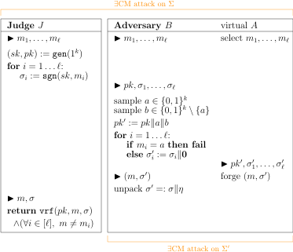

The advent of digital age has forced the art of signature design into an exact science. The inherent challenge in digital messages is the fact that every bit can be inspected and manipulated efficiently. Cloning becomes trivial. Trimming is as easy. Analyses and experiments carry out in astonishing speed. Secure signature seems impossible.

This series aims at showing the contrary, rigorously based on a few yet unproven assumptions/axioms that people strongly believe. The reader should not be discouraged by its "shaky" foundation. It is at least an attempt of formalization, of understanding what's going on. In fact, traditional signatures never enjoyed a systematic theory; what we are establishing here already far transcends the tradition. Moreover, many techniques that we apply are of independent interest, too.

In this instalment we set up a formal framework of signature schemes.

# A Terminology

**Definition.**
A function $$P: \Nat \to \Real^+$$ is called *negligible* if $$P(k) = o \left( \frac{1}{f(k)} \right)$$ for all polynomials $$f: \Real \to \Real^+$$.

**Examples.**
$$P(k) = 1/2^k$$ is negligible, while $$P(k) = 1/k^{100}$$ is not. 

# Abstraction

As the first step of formalisation, we abstract the secret and also the procedures of signing and verification. The procedures should take *little effort* as we suggested. In computational complexity terms, they should be polynomial-time algorithms.

**Definition.**
A *signature scheme* $$\Sigma = (\gen,\sgn,\vrf)$$ is a kit of three polynomial-time randomised algorithms:

- The key generation algorithm $$\gen(1^k)$$ returns a key pair $$(sk,pk)$$. Here $$k \in \Nat$$ intends to model the security level; $$1^k$$ is its unary form. Feeding larger $$k$$ would allow longer keys. The key $$sk$$ serves as the secret. The closely related key $$pk$$ is published to allow verification.
- The signing algorithm $$\sgn(sk,m)$$ returns a signature $$\sigma$$ which incorporates the secret $$sk$$ into the message $$m$$.
- The verification algorithm $$\vrf(pk,m,\sigma)$$ checks if the signature $$\sigma$$ indeed incorporates the correct secret into the message $$m$$.

In application, a signature scheme is used as follows. A $$k \in \Nat$$ is negotiated to ensure the desired level of security. Then the signer sets himself up by calling `gen` and acquires a key pair $$(sk,pk)$$. He keeps $$sk$$ and publishes $$pk$$. In a properly designed scheme, the $$pk$$ should carry some (but not all!) information about $$sk$$ to allow public verification, while keeping it computationally hard to infer $$sk$$. After the setup, the signer can `sgn` messages with his secret key $$sk$$, and the public can `vrf` authenticity with the public key $$pk$$. Depending on specific signature scheme, the secret may have a fixed quota on the messages it could sign. When the quota depletes, the signer shall inform the others and `gen` a new key pair for future signatures.

**Exercise.**
Pause and see how the abstraction captures the machinery of signatures that we discussed earlier.

# Correctness and Security

Up to now we have only specified the *syntactic* interface of signature schemes. This section defines our *semantic* requirements.

**Definition.**
A signature scheme $$(\gen,\sgn,\vrf)$$ is *correct* if it "recognises what it signs". That is, for all $$k \in \Nat$$, all possible $$(pk,sk)=\gen(1^k)$$ and all messages $$m$$, we have $$\vrf(pk, m, \sgn(sk,m)) = \texttt{true}$$.

**Example.**
The following (stupid) scheme is correct:

- $$\gen(1^k)$$ returns $$(sk,pk) := (b,b)$$ where $$b \in \set{0,1}^k$$ is sampled uniformly at random.
- $$\sgn(sk,m) := sk$$.
- $$\vrf(pk,m,\sigma) := \mathbb{1}[\sigma = pk]$$.

But a rational person will refuse to use it: The secret key is directly exposed to the public, giving everyone the permission to forge signatures with ease!

Clearly we are missing a semantic guarantee about security. In the previous article we concluded that "insecure = practically feasible to forge". But now we must be precise:

- What is "practically feasible"? Easy answer: using polynomially bounded resources.
- Then what are the resources that an adversary has access to? Candidates include time, space, budget, and information. The first three metrics can be roughly unified by time complexity, but the last dimension is fundamentally different. There are several capacity levels of information retrieval:
	- **$$\NM$$ (no message):** The adversary has access to $$pk$$ only.
	- **$$\RM$$ (random message):** The adversary knows $$pk$$ and can observe (message, signature) pairs produced by the signer, where the messages are sampled uniformly at random.
	- **$$\CM$$ (chosen message):** The adversary can pick and submit polynomially many messages in advance. Then he receives $$pk$$ and the signatures corresponding to his submitted messages.
	- **$$\CM^+$$ (chosen message, interactive):** The adversary knows $$pk$$ and can interactively request signatures of chosen messages at any time.
- Finally, what outcome is considered as successful forgery? There are various options, too:
	- **? (random forgery):** The adversary correctly forges the signature of a given random message, with non-negligible probability.
	- **∃ (existential forgery):** The adversary picks his favourite unseen message and correctly forges the signature, with non-negligible probability.

Among all combinations $$\exists\CM$$ and $$\exists\CM^+$$ are of central prominence, both granting the adversary plenty of information and freedom. We say a signature scheme is "<var>X</var> secure" if it withstands any adversary obeying combination <var>X</var>. Naturally, $$\exists\CM^+$$ secure schemes can resist quite fierce attacks.

In the following we repeat the security definitions via a more formal language, which makes everything crystal clear and helps us organise later proofs.

**Definition.**
The *$$\exists\CM$$ game* on signature scheme $$\Sigma = (\gen, \sgn, \vrf)$$ is given by

{:.centering}

*Remarks.*

- Here as always, the game executes in line order, and exactly one party is activated at any instant. The ► symbol declares that some external variable becomes accessible to the current party from that point on. For example, the "select" step cannot access external variable; the "forge" step, on the other hand, has access to $$pk$$ and $$\sigma_1, \dots, \sigma_\ell$$. All access are read-only.
- The adversary $$A$$ in the game is generic as the "select" and "forge" methods are not yet specified. A concrete adversary can implement them at his disposal. But we stress that he is *not* allowed to alter the game, e.g. access barred information, change the timeline or modify the behaviour of judge.

Similarly we can define $$\exists\CM^+$$ attacks.

**Definition.**
The *$$\exists\CM^+$$ game* on signature scheme $$\Sigma = (\gen, \sgn, \vrf)$$ is given by

{:.centering}

Finally we could state the security definition.

**Definition.**
Assume $$\Sigma$$ is a correct signature scheme. Assume game on $$\Sigma$$ is between judge $$J$$ and adversary $$A$$. If for all polynomial-time randomised algorithms `A` implementing $$A$$, the "success probability" $$P_{\texttt{A}}(k) := \Pr(J \text{ returns true})$$ is negligible, then we say $$\Sigma$$ is *game secure*.

*Remark.*
The randomness come from both $$J$$ and `A`.

# The Security Hierarchy

Intuitively, "resistance to more powerful adversary" means stronger security. So we ought to have the following security hierarchy:

{:.centering}

In fact, all these inequalities are *strict*. We will illustrate with a sample proof.

**Proposition 1.**
Provided that the definitions are non-empty, we have $$\exists\CM < \exists\CM^+$$.

*Proof.*
First we show the easy part that $$\exists\CM \leq \exists\CM^+$$. Namely, if a scheme is $$\exists\CM^+$$ secure, then it must be $$\exists\CM$$ secure. Let $$A$$ be *any* adversary performing $$\exists\CM$$ attack on the scheme. Observe that he automatically fits into the $$\exists\CM^+$$ attack as well (why?). Hence his success probability must be negligible by assumption.

Next we show the harder part that the two security concepts are different. Namely, there exists a scheme $$\Sigma = (\gen, \sgn, \vrf)$$ that is $$\exists\CM$$ secure but not $$\exists\CM^+$$ secure. Actually we shall prove a much stronger claim:

> Given any $$\exists\CM$$ secure scheme $$\Sigma = (\gen,\sgn,\vrf)$$, we can modify it (as a blackbox) into scheme $$\Sigma' = (\gen',\sgn', \vrf')$$ that is still $$\exists\CM$$ secure but not $$\exists\CM^+$$ secure.

The idea is to leverage the extra freedom in $$\exists\CM^+$$ attack. Though admittedly unrealistic, our scheme $$\Sigma'$$ shall actively *help* the adversary to forge a correct answer. However, only with the capability of dynamic interaction could the answer be retrieved.

{:.centering}

Clearly $$\Sigma'$$ is correct. But it is *not* $$\exists\CM^+$$ secure: After the adversary learns $$pk' = pk \Vert a \Vert b$$, he may enquire about the signature of $$a$$ and, as a byproduct, learn $$\eta = \sgn(sk,b)$$. Since  $$b$$ is an unseen message, the pair $$(b,\eta \Vert \mathbf{0})$$ constitutes a valid forgery.

Now we argue that $$\Sigma'$$ is still $$\exists\CM$$ secure. Let $$A$$ be *any* adversary performing $$\exists\CM$$ attack on $$\Sigma'$$. Based on it, we construct an adversary $$B$$ that performs $$\exists\CM$$ attack on $$\Sigma$$:

{:.centering}

Here $$B$$ serves as a double agent. He exploits his communications with $$J$$ and pretends as a judge for $$A$$. The algorithms `gen'` and `sgn'` are emulated even though $$B$$ has no idea of the secret key $$sk$$ at all. In the case of $$m_i = a$$, the ideal `gen'` should give $$\sigma_i = \sgn(sk,m_i) \Vert \sgn(sk,b)$$ whereas $$B$$ simply crashes. But fortunately this case happens with very low probability, so no issue would arise in the analysis.

Observe that if $$a \not\in \{m_1, \dots, m_\ell\}$$ and $$A$$ succeeds then $$B$$ also succeeds. Therefore,

$$\begin{align*}
	P_B(k)
	&\geq \Pr(A \text{ succeeds} \land a \not\in \{m_1, \dots, m_\ell\}) \\
	&\geq \Pr(A \text{ succeeds}) - \Pr(a \in \{m_1, \dots, m_\ell\}) \\
	&= P_A(k) - \frac{\ell}{2^k}
\end{align*}.$$

But $$P_B$$ is negligible due to the security assumption of $$\Sigma$$, and $$\ell/2^k$$ is negligible as well. So we conclude that $$P_A$$ is negligible, as required. ∎

# Complexity Assumptions Are Necessary

Our ultimate goal is to construct a $$\exists\CM^+$$ secure scheme (which is the most secure in our hierarchy), for which we will assume some (unproven) complexity conjectures. This is "necessary" in the following sense.

**Proposition 2.**
If there exists a $$?\NM$$ secure scheme (which is the weakest in our hierarchy), then RP ≠ NP and, in particular, P ≠ NP.

We defer its proof after we introduce the concept of one-way functions. By this proposition, even if we aim for a humble $$?\NM$$ secure scheme, we *must* assume some highly non-trivial and unproven complexity conjecture.
