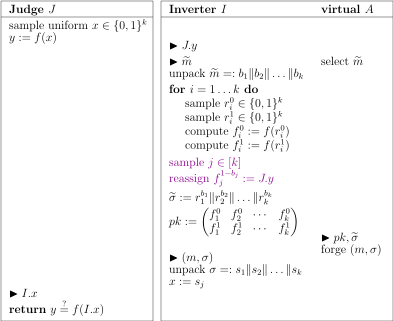

As a preliminary step towards our ultimate goal, we define a significantly weakened game.

**Definition.**
The *$$\ECM^1$$ (one-time chosen message) game* on signature scheme $$\Sigma = (\gen, \sgn, \vrf)$$ is given by

{:.centering}

Clearly it is the restriction of $$\ECM$$ when $$\ell \equiv 1$$, thus $$\ECM^1 \leq \ECM$$.

We will give three different constructions of $$\ECM^1$$ secure schemes, based on different complexity assumptions.

# Construction Based on One-Way Functions

Assume $$f:\set{0,1}^* \to \set{0,1}^*$$ is any one-way function. We design the following signature scheme (known as Lamport's generic scheme) with message space $$\set{0,1}^k$$.

{:.centering}

We remind the reader that each key contains $$2k$$ *strings*, not *bits*.

The scheme is obviously sound. Now we informally argue about its security.  Let $$A$$ be any $$\ECM^1$$ adversary. Since he can request signature for only one message $$\widetilde{m} \in \set{0,1}^k$$, only half of the $$2k$$ secret strings are revealed. If he wants to forge signature for some $$m := c_1 \Vert c_2 \Vert \dots \Vert c_k \neq \widetilde{m}$$ where the messages differ in the $$i$$-th position, say, then he must correctly compute the *unrevealed* secret string $$r_i^{c_i}$$. This inverts the image $$f_i^{c_i}$$, which is hard because $$f$$ is one-way.

Warning: the last sentence is not super rigorous. Recall that one-wayness means "hard to invert a random image". But for our argument, we want it "hard to invert $$f_i^{c_i}$$, the $$i$$-th out of $$k$$ random images where the position $$i$$ is by adversary's choice". The two notions are not exactly the same. Intuitively, the latter attack is easier because the adversary can choose the "weakest" image to attack.

To reduce the latter to the former, one has to "embed" the random image (in the former game) into the position $$i$$ that the adversary chooses (in the latter game). But who knows the choice of the adversary in advance? He might choose the first position, or the fifth position, or a random one. To deal with all behaviours, we *guess* a uniform random position to embed, thus tricking the adversary into our purpose with probability $$1/k$$. The idea is formally executed below.

{:.centering}

Here we are engaging in an inversion game. Internally we emulate a $$\ECM^1$$ judge for the adversary $$A$$ even though we have no idea about the real preimage of $$f^{1-b_j}_j$$. Our ignorance will not be caught since the signature of $$\widetilde{m}$$ does not use $$r^{1-b_j}_j$$. Hence, from the perspective of the adversary, everything goes as expected. He submits a valid forgery $$(m,\sigma)$$ with the same probability $$P_A$$ as in the real game.

Conditioned on $$(m,\sigma)$$ valid, we have

$$ c_1 \Vert c_2 \Vert \dots \Vert c_k := m \neq \widetilde{m} =: b_1 \Vert b_2 \Vert \dots \Vert b_k, $$

so there is at least one bit difference. Observe that $$j$$ is independent of $$pk,\widetilde{\sigma}$$ (why?) and consequently independent of $$(m,\sigma)$$ as well, so it is still uniformly distributed over $$[k]$$ under our condition. Hence $$\Pr(c_j \neq b_j \mid (m,\sigma) \text{ valid}) \geq 1/k$$.

If both the forgery is valid and $$c_j \neq b_j$$, then we know

$$ f(x') = f_j^{c_j} = f_j^{1-b_j} = y, $$

meaning that the inversion succeeds. Therefore, $$\Pr(J \text{ returns true}) \geq P_A / k$$. But the LHS is negligible by definition of one-way function, so we conclude that $$P_A$$ is negligible. ∎

Although being generic, the scheme uses very long keys which are expensive to transport. Next time we will discuss a general method that shortens public key. But for now, let us study two concrete constructions whose keys are significantly shorter by themselves.

# Construction Based on Exponentiation

Assume a group family $$(G_k,\times)$$ with generator $$g_k$$ and order $$n_k$$ for which discrete logarithm is hard. Throughout we shall omit the subscript $$k$$ for brevity. We design the following scheme with message space $$\Int_n$$.

{:.centering}

Quick check of soundness: For any $$\sigma := \sgn(sk, m) = \frac{\alpha-m}{\beta}$$ it holds that

$$ g^m \cdot b^\sigma = g^m \cdot g^{\beta \sigma} = g^{m + \beta \sigma} = g^\alpha = a. $$

Let us now justify the seemingly weird design. First, in order to exploit the one-wayness of exponentiation function, the secret key should "hide in the exponent" and the public key should be its exponentiated image, just as what `gen` does. Then, `sgn` should operate in the exponent part and `vrf` can check validity by exponentiating the signature and compare with the public key. Now, why does the secret key consists of two subkeys $$\alpha \Vert \beta$$? Imagine we have only $$\alpha$$ and define $$\sgn(sk,m) := \alpha - m$$ or maybe $$\alpha m$$, then the adversary could immediately infer $$\alpha$$. So we must introduce $$\beta$$ to obfuscate the signature. Finally, why is $$\beta$$ at the denominator instead of the numerator? For otherwise `vrf` will have a difficult time.

*Security proof.*
Let $$A$$ be any $$\ECM^1$$ adversary. We build an inverter for the exponentiation function:

{:.centering}

The inverter emulates a $$\ECM^1$$ judge for the adversary. The public key $$b$$ is taken as $$y$$; namely, we "borrow" the judge's $$\theta$$ as our $$\beta$$ even though its value is unknown. Note the following subtlety: $$\theta \in \Int_n$$ while in the true `gen` algorithm $$\beta \in \Int_n^*$$; the sampling spaces are slightly different. Fortunately for properly designed groups

$$ \Pr(\theta \in \Int_n^*) = \frac{\lvert \Int_n^* \rvert}{\lvert \Int_n \rvert} = \frac{\phi(n)}{n} \to 1, $$

so we are safe. We assume this condition and analyse the remaining steps.

Without the knowledge of $$\beta$$, how can we sign $$\widetilde{m}$$? The trick is to generate the answer $$\widetilde{\sigma}$$ straight away, which determines $$a := g^m \cdot b^{\widetilde{\sigma}}$$ and in turn fixes a unique $$\alpha: g^\alpha = a$$. Due to bijectivity, the resulting joint distribution is equivalent to the forward sampling $$\alpha \to a \to \widetilde{\sigma}$$, so the adversary will not perceive a difference.

Suppose the adversary returns a valid forgery $$(m,\sigma)$$. Then we have the equation system

$$\begin{align*}
	\sigma \beta &= \alpha - m \\
	\widetilde{\sigma} \beta &= \alpha - \widetilde{m}
\end{align*}$$

Solving it gives $$\beta = (m-\widetilde{m})/(\sigma-\widetilde{\sigma})$$, so we successfully invert the exponentiation function. Summarising our discussion, the inversion succeeds with probability $$(1-o(1)) \cdot P_A$$. Since this probability is negligible by the (believed) one-wayness of group exponentiation, we conclude that $$P_A$$ is negligible as well. ∎

# Construction Based on RSA

Assuming message space $$[0,2^k)$$, we build a scheme as follows:

{:.centering}

The soundness check is again easy: For any $$\sigma := \sgn(sk,m) = (a/b^m)^d$$ it holds that

$$ b^m \sigma^e = b^m \left( \frac{a}{b^m} \right)^{ed} = b^m \frac{a}{b^m} = a \pmod{n}. $$

It's time to justify our design of `sgn` and `vrf`. Why didn't we use a more straightforward approach such as $$\sgn(sk,m) := m^d$$ and $$\vrf(pk,m,\sigma) := \mathbb{1}\set{\sigma^e = m}$$? Well, if we did, then $$(1,1)$$ is always a valid (message, signature) pair. Even worse, the signature is multiplicative, so after observing one valid pair $$(m,\sigma)$$ we could forge thousands of valid pairs $$(m^2,\sigma^2), (m^3,\sigma^3), \dots$$.

Hence it is essential that we wrap the vanilla approach. Our choice $$(a/b^m)^e$$ effectively prevents the above two adversarial strategies:

- Given random $$a,b$$ it's hard to find a message $$m: a/b^m=1$$;
- Given a valid pair $$(m,\sigma)$$, raising it to powers shall break validity.

One might wonder if there are smarter ways of attacking the scheme. Our security analysis below excludes such possibility.

*Security proof.*
Let $$A$$ be any $$\ECM^1$$ adversary and we will build an inverter for the RSA function. Just as in the exponentiation scheme, the idea here is to revert the RSA function (i.e. computing $$e$$-th root) by a system of equations. More specifically, the valid pair $$(\widetilde{m},\widetilde{\sigma})$$, together with a valid forgery $$(m,\sigma)$$ provided by $$A$$, shall give us equations

$$ b^{\widetilde{m}} (\widetilde{\sigma})^e ~= a =~ b^m \sigma^e.$$

Assume without loss of generality that $$f := \widetilde{m} - m > 0$$, and denote $$\rho := \sigma/\widetilde{\sigma}$$. We have

$$ b^f = \rho^e. $$

Since $$e > 2^k > f$$ is a prime, we have $$\operatorname{gcd}(e,f) = 1$$. Hence by the extended Euclidean algorithm we can efficiently compute two integers $$u,v \in \Int$$ such that $$ue + vf = 1$$. Observe that

$$ (b^u \rho^v)^e = b^{ue} \cdot (\rho^e)^v = b^{ue} \cdot (b^f)^v = b^{ue+vf} = b. $$

Therefore $$b^u \rho^v$$ is an $$e$$-th root of $$b$$. The method is called *Shamir's trick* and will be used later in the notes. As an aside, since $$u,v$$ could be negative, we may need to compute inverses of $$b,\rho$$ which exist with overwhelming probability.

{:.centering}

The reader can smell many familiar ingredients. Since the inverter doesn't really know $$d$$, he can't sign the message via normal procedure. Instead, he just samples a random signature and uses it to determine $$a = b^{\widetilde{m}} \widetilde{\sigma}^e$$ backwards. Note that $$\widetilde{\sigma}^e$$ is uniformly distributed due to bijectivity. Plus, both $$b$$ and $$\widetilde{\sigma}$$ are in the multiplicative group $$\Int_n^*$$ with high probability and, under such condition, the $$a$$ is uniformly distributed. In other words, this backward simulation is equivalent to the normal procedure with high probability. The remaining argument is routine, which we leave as an exercise. ∎