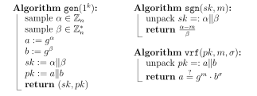
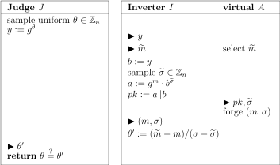
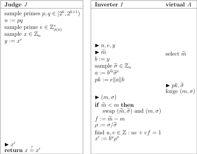

As a preliminary step towards our ultimate goal, we define a significantly weakened attack protocol.

**Definition.**
The *$$\ECM^1$$ (one-time chosen message) attack protocol* on signature scheme $$\Sigma = (\gen, \sgn, \vrf)$$ is given by

{:.centering}

Clearly it is the restriction of $$\ECM$$ when $$\ell \equiv 1$$, thus $$\ECM^1 \leq \ECM$$.

We will give three different constructions of $$\ECM^1$$ secure schemes, based on different complexity assumptions.

# Construction Based on One-Way Functions

Assume $$f:\set{0,1}^* \to \set{0,1}^*$$ is any one-way function. We design the following signature scheme (known as Lamport's generic scheme) with message space $$\set{0,1}^k$$.

{:.centering}

We remind the reader that each key contains $$2k$$ *strings*, not *bits*.

The scheme is obviously sound, and now we argue about its security.  Let $$A$$ be any $$\ECM^1$$ adversary. Since it could request signature for merely one message $$m^\circ \in \set{0,1}^k$$, only half of the $$2k$$ secret strings are revealed. In order to forge signature for some $$m := c_1 \Vert c_2 \Vert \dots \Vert c_k \neq m^\circ$$, the adversary must correctly compute at least one *unrevealed* secret string, say $$r_i^{c_i}$$. This in effect inverts the function image $$f_i^{c_i}$$, which is hard since $$f$$ is one-way.

The foregoing argument is basically correct, but the last sentence needs elaboration. Recall that in the inversion attack protocol, we as an inverter is given a single random image to be inverted. But for the signature scheme adversary, on the other hand, he may choose his *preferred* one of the $$k$$ (unrevealed) images to invert. He might always choose the first string, or the fifth string, or a random one, but we don't really know. We cannot even assume that the adversary is willing to cooperate with our goal of inversion. He might even counter our effort. So we must cunningly trick the adversary into our game. This is done by hiding the image to be inverted at a *random position* of the key:

{:.centering}

Here we emulate a $$\ECM^1$$ judge for the adversary $$A$$ even though we have no idea about the real preimage of $$f^{1-b_j}_j$$. Our ignorance will not be caught since the signature of $$m^\circ$$ does not use $$r^{1-b_j}_j$$. Hence, from the perspective of the adversary, everything goes smoothly as expected. He submits a valid forgery $$(m,\sigma)$$ with the same probability $$P_A$$ as in the real attack protocol.

Conditioned on $$(m,\sigma)$$ valid, we have

$$ c_1 \Vert c_2 \Vert \dots \Vert c_k := m \neq m^\circ =: b_1 \Vert b_2 \Vert \dots \Vert b_k, $$

so there is at least one bit difference. Observe that $$j$$ is independent of $$pk,\sigma^\circ$$ (why?) and consequently independent of $$(m,\sigma)$$ as well, so it is still uniformly distributed on $$[k]$$ under the condition. Hence $$\Pr(c_j \neq b_j \mid (m,\sigma) \text{ valid}) \geq 1/k$$.

If both the forgery is valid and $$c_j \neq b_j$$, then we know

$$ s_j = r_j^{c_j} \quad \text{and} \quad f(r_j^{c_j}) = f(r_j^{1-b_j}) = J.y, $$

meaning that the inversion succeeds. Therefore, $$\Pr(J \text{ returns true}) \geq P_A / k$$. But the LHS is negligible by definition of one-way function, so we conclude that $$P_A$$ is negligible. ∎

Although being generic, the scheme uses very long keys which are expensive to transport. Next time we will discuss a general method that compresses public key length. But for now, let us study two concrete constructions whose keys are significantly shorter by themselves.

# Construction Based on Exponentiation

Assume a "good" group family $$(G_k,\times)$$ with generator $$g_k$$ and order $$n_k = \mathrm{poly}(k)$$ for which discrete logarithm is hard. Throughout we shall omit the subscript $$k$$ for brevity. We design the following scheme with message space $$\Int_n$$.

{:.centering}

Quick check of soundness: For any $$\sigma := \sgn(sk, m) = \frac{\alpha-m}{\beta}$$ it holds that

$$ g^m \cdot b^\sigma = g^m \cdot g^{\beta \sigma} = g^{m + \beta \sigma} = g^\alpha = a. $$

Let us now justify the seemingly weird design. We should first agree that, in order to exploit the one-way property of exponentiation function, the secret key should "hide in the exponent part" and the public key should be its exponentiated image, just as what `gen` does. Given this, `sgn` should operate in the exponent part so that `vrf` can check validity by exponentiating the signature and compare with the public key. But why does the secret key consists of two subkeys $$\alpha \Vert \beta$$? Imagine we have only $$\alpha$$ and define $$\sgn(sk,m) := \alpha - m$$ or maybe $$\alpha m$$, then the adversary could immediately infer $$\alpha$$. So we must introduce another key $$\beta$$ to obfuscate the signature. (In fact the trick resists one-time attack only: If the adversary could observe *two* signatures then he can infer both $$\alpha$$ and $$\beta$$.) Why is $$\beta$$ at the denominator instead of the numerator? For otherwise `vrf` will have a difficult time.

After understanding the rationale, we start proving security. Let $$A$$ be any $$\ECM^1$$ adversary. We build an inverter for the exponentiation function:

{:.centering}

The inverter emulates a $$\ECM^1$$ judge for the adversary. The public key $$b$$ is taken as $$J.y$$, that is, we conceptually used $$J.\theta$$ as our $$\beta$$. (Of course, we don't know the real value of $$J.\theta$$.) Note the following subtlety: $$J.\theta \in \Int_n$$ while in the true `gen` algorithm $$\beta \in \Int_n^*$$; the sampling spaces are slightly different. Fortunately from number theory we have

$$ \Pr(J.\theta \in \Int_n^*) = \frac{\lvert \Int_n^* \rvert}{\lvert \Int_n \rvert} = \frac{\phi(n)}{n} = \Omega\left(\frac{1}{\sqrt{n}}\right), $$

which is non-negligible. Under this condition, we analyse the remaining steps.

Without the knowledge of $$\beta$$, how can we respond the signature of $$m^\circ$$? The trick is to generate the answer $$\sigma$$ straight away, which determines a unique $$a := g^m \cdot b^{\sigma^{\circ}}$$ backwards. This in turn determines a unique $$\alpha: g^\alpha = a$$ backwards. Due to bijectivity, such sampling is *equivalent to* the standard forward procedure $$\alpha \in \Int_n \to a \to \sigma$$, and the adversary will not perceive a difference.

Suppose the adversary returns a valid forgery $$(m,\sigma)$$. Then we have the equation system

$$\begin{align*}
	\sigma \beta &= \alpha - m \\
	\sigma^\circ \beta &= \alpha - m^\circ
\end{align*}$$

Solving it gives $$\beta = (m-m^\circ)/(\sigma-\sigma^\circ)$$, namely we successfully invert the exponentiation function. Summarising our discussion, the inversion succeeds with probability $$\Omega(n^{-1/2}) \cdot P_A$$. Since this probability is negligible by the (believed) one-way property of group exponentiation, we conclude that $$P_A$$ is negligible as well. ∎

*Remark.*
For some particular group families, for example $$(\Int_p, \times)$$, we could get rid of the $$\Omega(n^{-1/2})$$ factor in the proof by appropriately "shifting the exponent by 1". Consequently, our conclusion holds even when $$n = p$$ is exponential in $$k$$. In practice this is advantageous since a relatively small $$k$$ would guarantee high level of security.

# Construction Based on RSA

Assuming message space $$[0,2^k)$$, we build a scheme as follows:

{:.centering}

The soundness check is again easy: For any $$\sigma := \sgn(sk,m) = (a/b^m)^d$$ it holds that

$$ b^m \sigma^e = b^m \left( \frac{a}{b^m} \right)^{ed} = b^m \frac{a}{b^m} = a \pmod{n}. $$

It's time to justify our design of `sgn` and `vrf`. Why didn't we use a more straightforward approach such as $$\sgn(sk,m) := m^d$$ and $$\vrf(pk,m,\sigma) := \mathbb{1}\set{\sigma^e = m}$$? Well, if we did, then $$(1,1)$$ is always a valid (message, signature) pair. Even worse, the signature is multiplicative, so after observing one valid pair $$(m,\sigma)$$ we could forge thousands of valid pairs $$(m^2,\sigma^2), (m^3,\sigma^3), \dots$$.

Hence it is essential that we wrap the vanilla approach. Here our choice $$(a/b^m)^e$$ effectively prevents the above two forgery strategies:

- Given random $$a,b$$ it's hard to find a message $$m: a/b^m=1$$;
- Given a valid pair $$(m,\sigma)$$, raising it to powers shall break validity.

One might wonder if there are smarter ways of attacking the scheme. Our security analysis below excludes such possibility.

Let $$A$$ be any $$\ECM^1$$ adversary and we will build an inverter for the RSA function. Just as in the exponentiation scheme, the idea here is to revert the RSA function (i.e. computing $$e$$-th root) by a system of equations. More specifically, the valid pair $$(m^\circ,\sigma^\circ)$$, together with a valid forgery $$(m,\sigma)$$ provided by $$A$$, shall give us equations

$$ b^{m^\circ} (\sigma^\circ)^e ~= a =~ b^m \sigma^e.$$

Assume without loss of generality that $$f := m^\circ - m > 0$$, and denote $$\rho := \sigma/\sigma^\circ$$. We have

$$ b^f = \rho^e. $$

Since we chose $$e > 2^k > f$$ as a prime, it must hold $$\operatorname{gcd}(e,f) = 1$$. Hence by the extended Euclidean algorithm we can efficiently compute two integers $$u,v \in \Int$$ such that $$ue + vf = 1$$. Observe that

$$ (b^u \rho^v)^e = b^{ue} \cdot (\rho^e)^v = b^{ue} \cdot (b^f)^v = b^{ue+vf} = b. $$

Therefore $$b^u \rho^v$$ is an $$e$$-th root of $$b$$. As an aside, since $$u,v$$ could be negative, we may need to compute inverses of $$b,\rho$$ which do not necessarily exist. But in our application, the inverses do exist with overwhelming probability.

Given this method, we build the invertor as follows.

{:.centering}

The reader can smell many familiar ingredients. Since the inverter doesn't really know $$d$$, he can't sign the message via normal procedure. Instead, he just samples a random signature and uses it to determine $$a = b^{m^\circ} (\sigma^\circ)^e$$ backwards. Note that $$(\sigma^\circ)^e$$ is uniformly distributed due to bijectivity. Plus, both $$b$$ and $$\sigma$$ are in the multiplicative group $$\Int_n^*$$ with high probability and, under such condition, the $$a$$ is uniformly distributed. In other words, this backward simulation is equivalent to the normal procedure with high probability. The remaining argument is routine, which we leave as an exercise. ∎