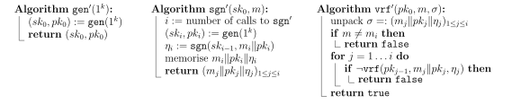

The seemingly useless $$\ECM^1$$ secure schemes turn out extremely powerful. Building on top of them, we can already achieve $$\ECM$$ security by the end of this chapter. Along the way we will explore and apply the indispensable concept of *hash functions*. Throughout the discussion we assume $$\Sigma = (\gen,\sgn,\vrf)$$ is any $$\ECM^1$$ secure scheme.

# Appetizer: Building $$\ECM^\ell$$ Secure Scheme

Let us warm up with the so-named $$\ECM^\ell$$ attack protocol, a crude approximation to the true $$\ECM$$ protocol. In this protocol, the adversary is allowed to submit up to $$\ell = \ell(k)$$ chosen messages in the beginning where $$\ell(k)$$ is a polynomial *fixed in advance by the signer*. For comparison: the true $$\ECM$$ protocol does not enforce a predetermined polynomial upper bound and thus can handle all possible polynomial adversaries.

**Exercise.**
Write a formal definition of the $$\ECM^\ell$$ attack protocol.

Although $$\ECM^\ell$$ security is weaker than $$\ECM$$ security, it is already applicable in some practical contexts. More importantly, it is rather easy to achieve and gives us valuable insights. One transparent construction $$\Sigma' := (\gen',\sgn',\vrf')$$ basically runs $$\ell$$ independent copies of $$\Sigma$$:

{:.centering}

**Exercise.**
Prove its soundness and $$\ECM^\ell$$ security.

# Chain Scheme

Now we take on the real battle: constructing a $$\ECM$$ secure scheme $$\Sigma' = (\gen',\sgn',\vrf')$$. Let us record two major limitations in our toy scheme from previous section:

- The public key is prohibitively long. It grows linearly with $$\ell$$.
- The number of signatures that it could sign is fixed in advance. After producing $$\ell$$ signatures, the signer must restart and redistribute the new public key.

They call for a more dynamic approach that generates and uses fresh keys on the fly. As the $$i$$-th signing/verifying depends only on $$(sk_i, pk_i)$$, there is no need to publish everything in advance. So why not try the following?

{:.centering}

But the scheme is not secure at all! Philosophically, we did not give away any public information (in the official way), so of course the verifier cannot distinguish authetic and fake signatures. Concretely, a forger could generate himself any key pair $$(sk^*,pk^*)$$ and forge $$(m, pk^* \Vert \sgn(sk^*,m))$$. By doing so, he fools the verifier to use a fake public key.

**Exercise.**
Why wasn't this an issue in the previous construction, where we published the key bundle at the outset "in the official way"?

To fix this critical bug, we must certify the authenticity of the public key shipped with the signature. That is, we must show a bond between the signer and the purported public key.

Sounds quite familiar. Yes, that's exactly what signatures are about! So we may utilise digital signature on a new level, namely to *sign the new public key $$pk_i$$ by the previous secret key $$sk_{i-1}$$*. Suppose that we initially published $$pk_0$$, then we may use $$sk_0$$ to sign $$pk_1$$, and $$sk_1$$ to sign $$pk_2$$, and so on. Essentially, the trust propagates from the "root key $$pk_0$$" down the chain to the newest key $$pk_i$$.

But don't forget that we only have $$\ECM^1$$ secure schemes at our disposal. Each secret key could thus sign *only once*. If the quota of $$sk_{i-1}$$ is used to sign $$pk_i$$, then no more chance is left to sign the real message. The simple solution is to bundle up $$m_i \Vert pk_i$$ so we could sign both at once.

{:.centering}

Just to repeat the intuition for the verification algorithm:

- If $$\vrf(pk_0, m_1 \Vert pk_1, \eta_1)$$ is true, then we confirm the bond between the signer and $$m_1 \Vert pk_1$$. This means the (purported) $$pk_1$$ is indeed the one owned by the signer.
- Then, if $$\vrf(pk_1, m_2 \Vert pk_2, \eta_2)$$ is true, we confirm the bond between the signer and $$m_2 \Vert pk_2$$. So the (purported) $$pk_2$$ is indeed the one owned by the signer.
- ...

Note that the design automatically resolves both limitations. The signer could sign as many as he wants, without the need of setting upper limit a priori.

There is one subtlety though: By calling $$\sgn(sk_{i-1}, ~m_i \Vert pk_i)$$ we implicitly assumed that the algorithm `sgn` could handle a message of length $$\lvert m_i \rvert + \lvert pk_i \rvert > \lvert pk_i \rvert$$. This is not always satisfied; for example Lamport's scheme can handle messages of length $$k$$, but the public key alone takes length $$\gg 2k$$ (the concrete number depends on the choice of one-way function but is nevertheless $$\omega(k)$$). Later we will present a general solution dealing with this, but for now let us ignore the subtlety and try to argue about $$\ECM$$ security.

*Security proof.*
Take any $$\ECM$$ adversary $$A$$ for $$\Sigma'$$, we can construct a $$\ECM^1$$ adversary $$B$$ for $$\Sigma$$, as follows:

{:.centering}

Note that the adversary $$B$$ embeds the judge's public key into a random position $$t-1$$ of his key chain. All the other keys in the chain are generated by $$B$$ himself. From the view of $$A$$ the game is identical to a $$\ECM^1$$ protocol. Whenever $$A$$ successfully forges a valid pair $$(m',\sigma')$$ where $$\sigma' = (m_j' \Vert pk_j' \Vert \eta_j')_{1 \leq j \leq i'}$$, we know

- $$m_{i'} = m' \not\in \set{m_1, \dots, m_\ell}$$.
- So there must exist an index $$j \in [\ell]$$ from which the $$m_j' \Vert pk_j'$$ begins to deviate from $$m_j \Vert pk_j$$. Before that the two trajectories agree and thus in particular $$pk_{j-1} = pk_{j-1}'$$.
- Hence $$(m_j' \Vert pk_j', ~\eta_j')$$ is a valid forgery with respect to key $$pk_{j-1}$$.

We don't actually know the index value $$j$$, but since it is independent of $$t$$, we have $$\Pr(t = j) = 1/\ell$$ chance of guessing correctly. Under this event the output forgery is valid with respect to $$pk_{t-1} = pk$$ and thus $$B$$ succeeds. Therefore $$P_B = P_A / \ell$$. Since $$P_B$$ is negligible, we conclude that $$P_A$$ is negligible as well. ∎

*Remark.*
After seeing the formal proof it is beneficial to step back and interpret it in an intuitive level. Breaking the security of $$\Sigma'$$ basically means breaking an arbitrary link in the chain. So it is "$$\ell$$ times easier" than breaking a particular link. Nevertheless, security is not violated because $$\ell$$ is a polynomial.

# Tree Scheme

The chain scheme is based on the idea trust propagation, but there are better topologies to propagate trust, for instance a tree topology. Roughly, we start from the root key $$pk_{\epsilon}$$ and spawn two keys $$pk_0$$ and $$pk_1$$, which in turn branch into $$pk_{00}, pk_{01}$$ and $$pk_{10}, pk_{11}$$ respectively, and so on. We repeat for depth $$k$$ and end up with a binary tree with $$2^k$$ leaves. Each leaf corresponds to a binary string of length $$k$$. We sign any given message $$m \in \set{0,1}^k$$ by key $$sk_m$$, and append the path from $$m$$ to the root to allow verification. Note that we grow the tree on demand, so the space consumption is only a linear function of the messages signed.

{:.centering}

The security proof is essentially the same as the chain scheme. Here we make a few comments on the construction:

- Again, we implicitly assumed that the `sgn` algorithm could handle long messages -- twice long as public key.
- Only $$k$$ keys are lying on the path from $$m$$ to root (illustrated in black). But in the run we also tag along $$k$$ "sibling" keys (illustrated in gray) as preparation for future.
- The scheme fundamentally improves the chain scheme in two ways. First, the signature length does not grow with $$\ell$$ (the number of messages signed so far) as before. Say the message space is $$\set{0,1}^k$$, then the signature length is just $$k$$ times a constant factor. Second, the signatures do not carry current or previous messages any more, which is apparently more practical in applications.

# Extending Message Space

In this section we tackle the subtlety mentioned earlier: For the chain/tree constructions to work, the underlying scheme $$\Sigma$$ must support messages that are strictly longer than its public key. Some $$\Sigma$$ such as Lamport's scheme do not satisfy this requirement. But fortunately there are general recipes that *extend* the message space of $$\Sigma$$ without sacrificing security. Here we will focus on a method based on hashing.

In short, the idea is "compressing before signing". Suppose $$\Sigma$$ supports messages of length $$r$$, but we want it to sign a long bulk which does not fit. Then we may first apply a compression function (also called *hash function*) $$H: \set{0,1}^* \to \set{0,1}^r$$ and then sign the image.

{:.centering}

To ensure security, though, we cannot choose the compression function $$H$$ arbitrarily. Consider for example the constant function $$H(x) \equiv 0$$. It does compress, but also breaks security. Note that any $$m \neq \widetilde{m}$$ shall give rise to the same signature, thus rendering the scheme insecure under $$\ECM^1$$ attack.

Abstractly, the problem with constant function (and many other naïve functions) is "image collisions". So we should look for an $$H$$ that has least collisions as possible -- well, not quite. Since $$H$$ compresses, there *will be* plenty of collisions. Instead of the impossible task of eliminating them, we should eliminate the chance that an adversary finds any (of the many) collisions. This is the rationale behind collision-resistant hash schemes, which we now formally define.

**Definition.**
A *hash scheme* is a pair $$(\spl, H)$$, where

- the randomised polynomial-time algorithm $$\spl(1^k)$$ samples a descriptor of a concrete function;
- the functor $$H$$ can be instantiated with the descriptor $$s$$ into a polynomial-time computable function $$H_s: \set{0,1}^* \to \set{0,1}^{r(s)}$$.

It is called *collision-resistant* if, for all polynomial-time adversaries $$A$$ participating in the following attack protocol, the success probability is negligible:

{:.centering}

Why didn't we choose to write the definition for a single, fixed function? In fact the concept makes no sense then. If the function is known in advance rather than sampled dynamically, then mathematicians might work out a collision pair $$(x,x')$$ (though maybe taking 50 years) and the adversary could simply output it to win the game. If you think over this deeper, you will as well understand why the inversion attack protocol for one-way functions samples the image randomly.

**Exercises.**
- Modify our previously imprecise defintion of $$\Sigma^* = (\gen^*, \sgn^*, \vrf^*)$$ to reflect the correct use of hash scheme.
- Prove under your modification: If $$\Sigma$$ is $$\ECM^1$$ secure and the hash scheme is collision-resistant, then $$\Sigma^*$$ is also $$\ECM^1$$ secure.

**Exercise.**
Show that if collision-resistant hash schemes exist, then one-way functions exist. (*Remark: the converse is not known.*)

Collision resistant hash schemes can be constructed from many concrete assumptions such as the hardness of discrete logarithm, which we do not explore here. We conclude with a few more remarks on other approaches to extend message space.

- There is a weaker notion of collision-resistance hashing, commonly known as *universal one-way hashing*, that achieves the same goal. The corresponding construction/proof is more involved. However, the approach attracts theoretical interest because it does not make additional assumptions other than the existence of one-way functions.
- There is also a (rather simple) method that extends message space exponentially. It basically slices a long message into blocks and sign them individually. The method preserves $$\ECM$$ and $$\ECM^+$$ security. Unfortunately it does *not* preserve $$\ECM^1$$ security, so we could not apply it in our current context.